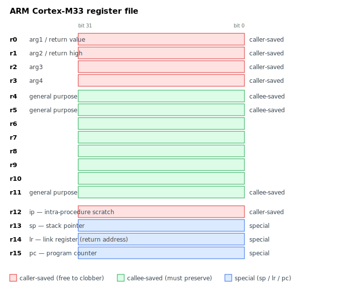
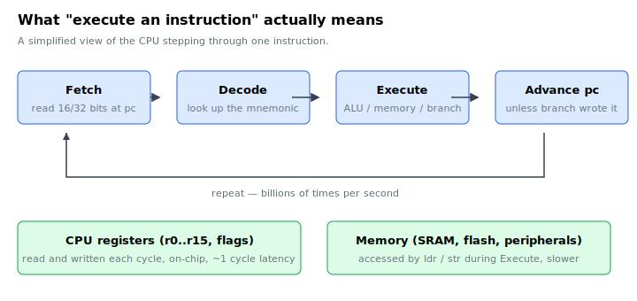

# Chapter 2 — What is assembly language?

Before we touch a Pico, let's get clear on what assembly *is*.

## The two-sentence answer

A CPU executes binary instructions — patterns of bits the silicon knows
how to interpret. Assembly language is a human-readable, one-to-one
spelling of those instructions, so that you can write them without
juggling hex by hand.

That's it. There is no magic; there is no runtime. An assembler is just
a translator that turns `mov r0, #25` into the specific 16- or 32-bit
pattern the chip recognises as "put the number 25 into register zero".

## The pieces of a CPU

To write assembly you need a working mental model of what's inside the
chip. There are only three things to know.

### 1. Registers

A **register** is a small, named storage slot inside the CPU itself.
On the ARM Cortex-M33 you have 16 of them, named `r0` through `r15`.
Each holds 32 bits — a single 4-byte word.



*We'll come back to this picture in detail in [chapter 4](04-cortex-m33-and-thumb2.md)
and [chapter 8](08-functions-and-calling-convention.md). For now, just register
the shape: sixteen named slots, each 32 bits wide.*

Registers are fast. Reading or writing one usually takes a single
cycle. Compare that with RAM, which on the RP2350 takes a few cycles
even in the best case. Most of what assembly does is move values
between registers, do arithmetic on them, and occasionally store them
back to memory.

A few of the registers are special:

- `r13` is the **stack pointer** (`sp` for short). It points at the
  current top of the call stack.
- `r14` is the **link register** (`lr`). When you call a function, the
  return address is stashed here.
- `r15` is the **program counter** (`pc`). It points at the instruction
  about to execute. Writing to it is how branches work under the hood.

The other thirteen — `r0` through `r12` — are general-purpose. You can
use them for whatever you like, subject to a few conventions we'll meet
in chapter 8.

### 2. Memory

Outside the CPU there's a much bigger, much slower pool of storage:
**memory**. On the RP2350 this is 520 KB of SRAM. Every byte has an
address — a number — and instructions like "load" and "store" move data
between registers and memory.

You can't add two numbers that live in memory directly. The pattern is
always:

1. Load value A from memory into a register.
2. Load value B from memory into another register.
3. Add them in registers.
4. Store the result back to memory.

This load-store discipline is the defining feature of RISC ("reduced
instruction set computer") architectures like ARM. It is *not* how an
x86 instruction set works — `add [some_address], 5` is perfectly legal
on x86 — but it is how every modern phone, tablet, and most embedded
chips work.

### 3. Instructions

An **instruction** is a single command the CPU executes. There are only
a few kinds:

- **Data movement.** `mov` copies one register to another or loads an
  immediate constant. `ldr` loads from memory; `str` stores to memory.
- **Arithmetic and logic.** `add`, `sub`, `and`, `orr`, `lsls`
  (left-shift), and so on.
- **Comparison.** `cmp` subtracts two values but throws away the result,
  setting flags (zero, negative, carry, overflow) that the next branch
  instruction looks at.
- **Branches.** `b label` jumps unconditionally. `beq label` jumps only
  if the zero flag is set. `bl func` ("branch and link") jumps and saves
  the return address in `lr` — that's how function calls work.

That is the entire toolkit. Even the most elaborate program — a
1300-page operating system kernel, a web browser, this very text editor
— is, somewhere inside, a sequence of these primitive instructions.

The CPU runs that sequence in a tight loop:



At 150 MHz this loop runs 150 million times a second. Every loop body
either burns a cycle doing arithmetic in registers, or pays a few extra
cycles to load/store memory. Programs are nothing but very long
trajectories through this loop.

## A tiny example

Here is an actual program that adds 3 and 4 and stops:

```asm
    movs    r0, #3      @ r0 = 3
    movs    r1, #4      @ r1 = 4
    adds    r0, r0, r1  @ r0 = r0 + r1
1:  b       1b          @ loop forever
```

Read it line by line.

- `movs r0, #3` puts the literal value 3 into register r0. The `#`
  marks an immediate constant.
- `movs r1, #4` puts 4 into r1.
- `adds r0, r0, r1` computes r0 + r1 and stores it in r0. (After this,
  r0 holds 7.)
- `1:` is a local label. `b 1b` means "branch to the nearest label `1`
  *backwards*". The CPU spins on that line forever, because a
  microcontroller has nowhere else to go when its program "ends".

The `@` character starts a comment in GNU ARM assembler syntax. You'll
see them everywhere in rp-asm.

That program, assembled, is six bytes of machine code. Six bytes is a
complete, runnable program. Welcome to the metal.

## Why does the `s` matter in `movs`?

You may have spotted it: `mov` versus `movs`, `add` versus `adds`. The
trailing `s` means "and update the condition flags". `adds r0, r0, r1`
adds *and* sets the zero/negative/carry/overflow flags so the next
conditional branch can react to the result. Plain `add` adds but
leaves the flags alone.

On the Cortex-M0+ inside the original Raspberry Pi Pico, almost every
short-form instruction sets flags whether you want to or not — the
`s` is encoded into the 16-bit instruction shape. On the Cortex-M33
inside the Pico 2 you have more flexibility. We'll come back to this in
chapter 4.

## Mnemonics, opcodes, and the assembler

When the assembler sees `movs r0, #3`, it looks up the bit pattern for
"move-immediate-with-flag-update", fills in the register field (r0 = 0)
and the immediate field (3), and emits the 16-bit value `0x2003`. That's
all an assembler does — it is a glorified table lookup.

The word `movs` is called a **mnemonic**. The bit pattern is called an
**opcode** (more precisely the opcode and operand fields packed
together). You read mnemonics. The CPU reads opcodes. They are the same
information.

## What about labels, sections, and directives?

Real assembly files contain more than instructions. They contain:

- **Labels** like `main:` or `1:` — names attached to addresses.
- **Directives** like `.section .text` or `.equ FOO, 42` — instructions
  to the *assembler*, not to the CPU. They control output layout,
  define constants, align things, and so on.
- **Comments** — `@ ...` to end of line.

Chapter 7 covers the syntax in detail. For now, when you see something
that starts with a dot, it's a directive; when you see something that
ends with a colon, it's a label.

## Exercises

1. **Trace the tiny example.** Walk through the four-instruction program
   above on paper. After each instruction, write down the value of `r0`
   and `r1`. What's the final state? *(Answer: r0 = 7, r1 = 4, and the
   CPU loops on `b 1b` forever.)*

2. **Spot the directive.** In the program below, mark each line as
   either *instruction*, *label*, *directive*, or *comment*.

   ```asm
       .section .text.foo, "ax"     @ A
   foo:                             @ B
       movs    r0, #42              @ C
       bx      lr                   @ D
   ```

   *(A is a directive, B is a label, C is an instruction with a
   trailing comment, D is an instruction.)*

3. **`mov` vs `movs`.** Why do `adds` and `subs` exist when `add` and
   `sub` already do the arithmetic? Find one place this distinction
   would matter for control flow. *(The flag-setting `s` form lets the
   next conditional branch react. `adds r0, #1` followed by `beq` jumps
   when the result is zero; plain `add` would leave the flags from
   whatever happened earlier.)*

4. **Read a number.** What is the value of the 16-bit Thumb encoding
   `0x2003`? Refer back to the section on mnemonics and opcodes.

## What's next

You now know enough vocabulary — register, memory, instruction, label
— to read any assembly program. The next two chapters give you the
specific context for *our* assembly: the [RP2 chip family](03-the-rp2-family.md),
and the [ARM Cortex-M33 core](04-cortex-m33-and-thumb2.md) that runs
our code.

<!-- nav-footer -->

---

[← Chapter 1 — Introduction](01-introduction.md) · [Table of contents](README.md) · [Chapter 3 — The RP2 family →](03-the-rp2-family.md)
