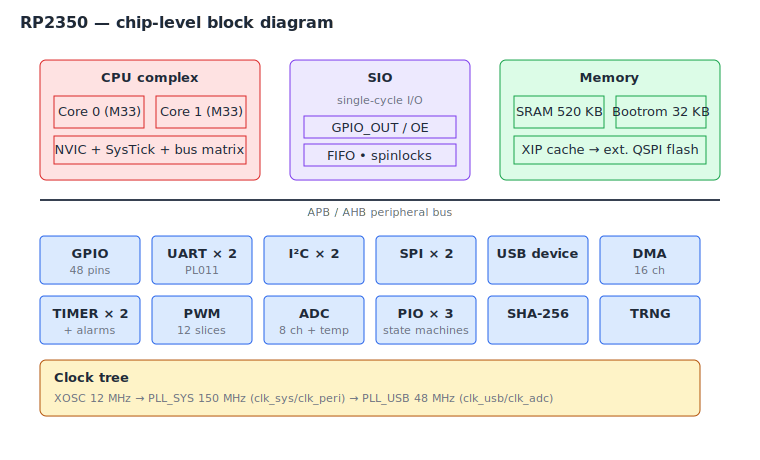
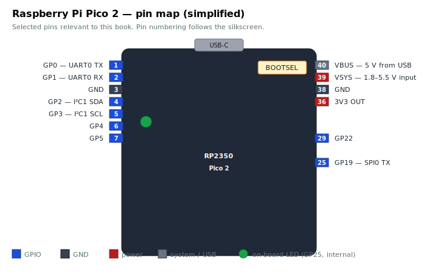
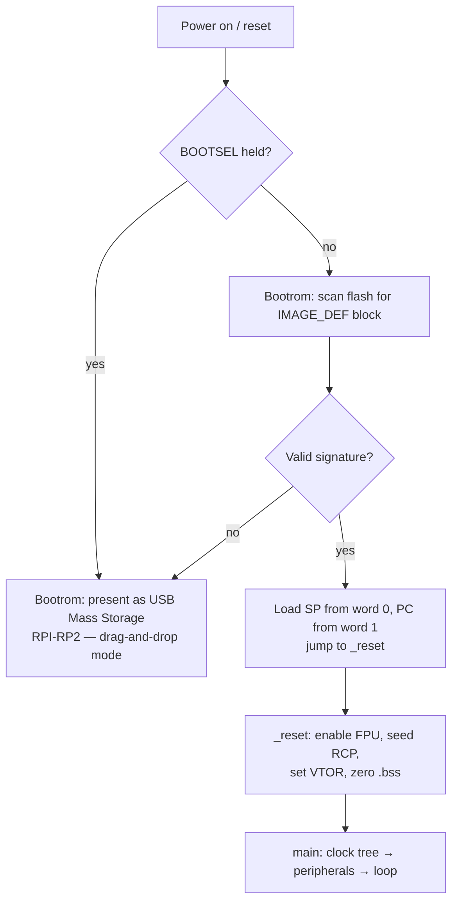

# Chapter 3 — The RP2 family

The "RP2" in rp-asm refers to the family of microcontrollers designed
by Raspberry Pi Ltd themselves — first the RP2040 (launched in 2021)
and then the RP2350 (launched in 2024). They are the silicon at the
heart of the Raspberry Pi Pico and Pico 2 boards.

This chapter is a tour of what these chips are, how they differ, and
why rp-asm targets the RP2350 specifically.

## What is a microcontroller?

A **microcontroller** is a chip that contains, on a single die:

- One or more CPU cores
- Some RAM
- Some non-volatile storage (usually flash)
- A bunch of peripherals — UART, SPI, I2C, USB, ADC, timers, GPIO
- A clock generator
- A bootloader in ROM

A microcontroller is the whole computer. There is no separate northbridge,
no DDR memory chip, no BIOS firmware on a separate flash, no PCIe video
card. You plug it in, it boots, it runs your program. Many microcontrollers
sell for less than the cost of a coffee.

This integration is what makes embedded programming feel so direct. The
peripheral you want to talk to is on the *same chip* as your CPU,
addressable through ordinary memory addresses. There's no kernel driver
in the way.

## The RP2040 (Raspberry Pi Pico)

The RP2040, released in 2021, was Raspberry Pi's first chip. It has:

- Two ARM **Cortex-M0+** cores at up to 133 MHz
- 264 KB SRAM
- No internal flash (boards usually pair it with an external 2 MB QSPI
  flash chip)
- 30 multi-function GPIO pins
- Two UARTs, two SPIs, two I2Cs
- A USB 1.1 device/host controller
- 16-channel DMA
- **PIO** — Programmable I/O, two state-machine engines that can
  implement custom peripheral protocols

The Cortex-M0+ is the smallest, simplest CPU in ARM's lineup. It has a
limited Thumb-only instruction set, no hardware divide, no DSP
extensions, and only 16-bit instructions. This makes it cheap and
power-efficient. It also makes it slightly awkward to write assembly
for: you have to be careful which registers you touch with which
instructions, because the M0+ encoding can only address `r0`–`r7` from
many opcodes.

## The RP2350 (Raspberry Pi Pico 2)

The RP2350, released in 2024, is the chip rp-asm targets. It is a
substantial upgrade from the RP2040:

| Feature | RP2040 | RP2350 |
| --- | --- | --- |
| CPU cores | 2× Cortex-M0+ | 2× Cortex-M33 (plus 2× RISC-V Hazard3, switchable) |
| Max clock | 133 MHz | 150 MHz |
| SRAM | 264 KB | 520 KB |
| Internal flash | None | None (Pico 2 board adds 4 MB QSPI) |
| GPIO pins | 30 | 48 |
| Floating point | Software only | Optional FPU on Cortex-M33 |
| Security | None | TrustZone-M, signed boot, OTP |
| ADC | 12-bit, 4ch + temp | 12-bit, 8ch + temp |
| SHA-256 | None | Hardware accelerator |
| TRNG | None | Hardware RNG |

The headline change for our purposes is the CPU. The **Cortex-M33** is
a much more capable processor than the M0+:

- Full **Thumb-2** instruction set — every register (`r0`–`r12`) is
  usable in every common encoding, plus 32-bit instructions for things
  the 16-bit ones can't express.
- Hardware integer divide.
- DSP-style multiply-accumulate instructions.
- An optional FPU (the Pico 2 silicon ships with it enabled).
- A more powerful interrupt controller and more flexible memory
  protection.

You can also boot the RP2350 into a *RISC-V* mode where two Hazard3
cores replace the ARM ones, sharing the same peripherals. rp-asm
ignores this entirely and runs the chip as a pair of Cortex-M33s. (If
you ever want to learn RISC-V assembly, this chip is also a friendly
place to do it — but that's a different book.)

## What's on the Pico 2 board

The **Raspberry Pi Pico 2** is a small (51 × 21 mm) PCB built around
the RP2350. It adds:

- A 12 MHz crystal oscillator (the chip's clock source)
- 4 MB of external QSPI flash for program storage
- A USB-C connector wired to the RP2350's USB controller
- A green LED on GP25, which you'll be blinking shortly
- A BOOTSEL button that, when held during reset, puts the chip into
  USB Mass Storage Class mode so you can drag-and-drop firmware

There is also a Pico 2 W variant with onboard Wi-Fi/Bluetooth via an
extra chip; rp-asm doesn't currently use the wireless, but everything
else on the W is identical to the non-W board.

We'll meet most of these pins again in later chapters: GP0/GP1 in
[chapter 10](10-uart.md) (UART), GP25 in [chapter 6](06-your-first-program.md)
and [chapter 9](09-gpio-and-memory-mapped-io.md) (LED), and the
BOOTSEL button in [chapter 5](05-setting-up-rp-asm.md) (flashing).

## The boot sequence (quick preview)

When you power on a Pico 2, here's what happens:

1. The RP2350's internal **bootrom** runs first. It is a 32 KB read-only
   program baked into the silicon at Raspberry Pi's factory.
2. The bootrom checks whether BOOTSEL is held. If so, it presents
   itself as a USB Mass Storage device — that's the "drag-and-drop a
   UF2 file" mode.
3. Otherwise, it reads the first few hundred bytes of QSPI flash,
   verifies an `IMAGE_DEF` signature block, and jumps to your firmware's
   reset handler.
4. Your reset handler sets up the C-runtime-style state (stack pointer,
   .bss, vector table), brings up the clock tree, and calls `main`.

rp-asm provides all of step 4 for you — see `src/startup.S` and
`src/main.S`. From your perspective, "boot" just means "`main` gets
called". We will read the bootrom-to-`main` handoff in [chapter 6](06-your-first-program.md).

## Why an RP2350 and not, say, an STM32?

There are dozens of microcontroller families with ARM Cortex-M cores.
Why this one?

- **Excellent documentation.** The RP2350 datasheet is unusually clear
  and complete by industry standards. Every register is explained.
- **Open-friendly.** Raspberry Pi publishes the bootrom source, the
  pico-sdk, the silicon errata, and even the chip's hardware design
  files. There are no NDAs.
- **Cheap and available.** US$5 for a Pico 2, easy to source globally.
- **Modern Cortex-M33.** Old enough to have lots of tutorials, new
  enough to have full Thumb-2 — which makes assembly much easier than
  on, say, an STM32F0.
- **Cool peripherals.** PIO in particular is unique to this chip
  family and a delight to program.

## Exercises

1. **Compare the M0+ and the M33.** Look at the comparison table. Name
   three RP2350 features that the RP2040 doesn't have. For each, why
   might it matter when writing assembly?

2. **Pin a peripheral.** Using the Pico 2 pinout figure, which physical
   pins would you wire to talk to an I²C sensor? *(Hint: GP2/GP3, plus
   GND and 3V3.)*

3. **Bootrom hand-off.** From the boot flowchart, what is in `r13`
   (the stack pointer) at the instant `_reset` starts executing?
   *(The value the bootrom loaded from word 0 of the vector table —
   i.e. the symbol `_stack_top` declared in `src/startup.S`.)*

4. **Why no SRAM boot?** The README notes that SRAM-resident images
   don't run on real Pico 2 silicon. Why is that an erratum and not a
   design choice? *(Bootrom is supposed to be able to launch SRAM
   images; the A2 silicon has a defect in that path. Workaround: build
   the flash variant for hardware.)*

## What's next

[Chapter 4](04-cortex-m33-and-thumb2.md) zooms in on the Cortex-M33
itself: the register file, the Thumb-2 instruction set, the memory map,
and the boot-time state your code inherits. After that we install the
toolchain and start writing.

<!-- nav-footer -->

---

[← Chapter 2 — What is assembly language?](02-what-is-assembly.md) · [Table of contents](README.md) · [Chapter 4 — The Cortex-M33 and Thumb-2 →](04-cortex-m33-and-thumb2.md)
