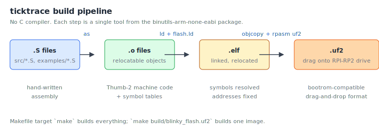

# Chapter 5: Setting up ticktrace

In this chapter we install the toolchain, clone ticktrace, and build the
default `blinky.uf2`. By the end you'll be one drag-and-drop away from
a running program.

## What you'll install

Three things:

1. The **GNU ARM embedded toolchain**, the assembler (`arm-none-eabi-as`),
   linker (`arm-none-eabi-ld`), and a few helpers like `objcopy`.
2. **Python 3** and a couple of Python libraries, used by the test
   harness and the UF2 packer.
3. The **ticktrace source tree** itself.

You do **not** need GCC or any C compiler. ticktrace is pure assembly;
the C compiler in `binutils-arm-none-eabi` is not used.



## Linux (Debian / Ubuntu / Raspberry Pi OS)

```console
$ sudo apt update
$ sudo apt install binutils-arm-none-eabi python3 python3-venv git
```

That's the full host-side setup. On other distributions, install the
equivalent packages, Fedora has `arm-none-eabi-binutils-cs`, Arch has
`arm-none-eabi-binutils`, and so on.

## macOS

```console
$ brew tap ArmMbed/homebrew-formulae
$ brew install arm-none-eabi-gcc python3 git
```

(Yes, the package is named `arm-none-eabi-gcc`, but it includes the
binutils we actually need.)

## Windows

Use WSL2 and follow the Linux instructions inside it. Native Windows
toolchains exist but are not what ticktrace is tested against.

## Verifying the toolchain

After installing, you should be able to run:

```console
$ arm-none-eabi-as --version
GNU assembler (...) 2.40
...
$ arm-none-eabi-ld --version
GNU ld (...) 2.40
...
$ python3 --version
Python 3.11.x
```

If any of those error out, fix that before continuing, nothing later
will work.

## Cloning ticktrace

```console
$ git clone https://github.com/amken3d/rp-asm.git
$ cd ticktrace
```

Take a moment to look around:

```console
$ ls
Makefile  README.md  benchmarks/  book/      c_apps/
c_bridge/ docs/      examples/    include/   link/
rust_apps/ rust_bridge/ src/      tests/     tools/
```

The directories you'll care about most as a beginner:

- `src/`, the driver implementations, one `.S` file per peripheral.
- `examples/`, short demo programs. We'll be making more of these.
- `include/`, the register/bitfield definitions for every peripheral.
- `link/`, linker scripts. `flash.ld` lays your program out at the
  XIP flash window (`0x10000000`); `sram.ld` lays it out at SRAM
  (`0x20000000`). Both work on hardware.
- `tools/bin/rpasm`, the in-tree Go CLI built from `tools/cmd/rpasm/`.
  Its `uf2 pack` subcommand packs a raw binary into the UF2 format the
  bootrom expects; `mkmanifest` and `mkfirmware` build the bootloader
  chain. (The older `tools/uf2.py` is still in the tree as a parity
  reference but the Go tool is the canonical one going forward.)

## Installing the Python dependencies

ticktrace uses a virtualenv to keep its test dependencies out of your
system Python. The Makefile has a one-shot target for this:

```console
$ make pydeps
```

This creates `.venv/` and installs the test harness libraries
(`unicorn`, `pyelftools`, `pytest`). It only needs to run once.

## Your first build

Now build the default firmware:

```console
$ make
```

You should see a stream of `arm-none-eabi-as` and `arm-none-eabi-ld`
invocations, ending in something like:

```
  PACK    build/blinky.uf2
```

Look at the result:

```console
$ ls -lh build/blinky.uf2
-rw-r--r-- 1 you you 2.1K ... build/blinky.uf2
```

That's a complete program for the RP2350: clock-tree bring-up, GPIO,
UART, the banner, and the LED toggle loop, packaged in 2 KB. Most of
that is UF2 overhead, the underlying program is only 728 bytes of
machine code.

This `blinky.uf2` is the **SRAM** variant: the bootrom loads it
into SRAM at `0x20000000` and runs it from there. It's also what the
emulation test tiers (Unicorn, QEMU, Renode) consume.

For firmware that survives a power cycle, build the **flash**
variant, which goes into XIP flash at `0x10000000`:

```console
$ make build/blinky_flash.uf2
```

Both variants boot on real hardware. The packer picks the right UF2
family ID automatically from the load address.

## Running it in emulation (optional)

You don't strictly need a Pico 2 to follow this book. ticktrace's test
harness runs every driver under Unicorn (a CPU emulator) and the
public examples under QEMU. To smoke-test your install:

```console
$ make test
```

You should see hundreds of passing tests. If anything fails, that's
worth investigating before proceeding, the tests catch most toolchain
mismatches.

## Running it on hardware

Plug your Pico 2 in while holding the **BOOTSEL** button. It will
mount as a USB Mass Storage device named `RPI-RP2`. Drag either
`build/blinky.uf2` (SRAM, lost on power loss) or
`build/blinky_flash.uf2` (XIP flash, persistent) onto it.

The Pico 2 will:

1. Accept the file
2. Reboot
3. Print `ticktrace M2 - clk_sys = 150 MHz` over UART0 TX (GP0)
4. Blink its onboard green LED at roughly 2 Hz

To see the UART output, connect a USB-to-serial adapter:

| Pico 2 pin | USB-serial pin |
| --- | --- |
| GP0 (UART0 TX) | RX |
| GND | GND |

Then open a serial terminal at **115200 8N1**. On Linux:

```console
$ sudo apt install minicom
$ minicom -D /dev/ttyUSB0 -b 115200
```

…or `screen /dev/ttyUSB0 115200`, or `picocom`, or whatever you like.

> **Order matters.** The banner is printed once, in the first
> ~100 ms after `_reset`. If you flash first and *then* open the
> terminal, the banner has already gone by, and you'll see the LED
> blinking but no text. Either:
>
> - Open the serial terminal first, *then* drag the UF2 onto
>   `RPI-RP2` (the board reboots into the new image after the drive
>   ejects, and minicom catches the banner), or
>
> - With the terminal already open, tap the on-board RUN/RESET pin
>   on the Pico 2; the board reboots and re-prints the banner.
>
> Later chapters' examples that talk over USB-CDC have the same
> race; chapter 10 shows a banner-loop pattern that survives a
> late-attaching host.

If you don't have a USB-serial adapter, several examples use the Pico's
built-in USB controller as a USB-CDC serial device, those work on
nothing but the original USB-C cable. We'll get to those in chapter 10.

## What just happened?

You built and ran a piece of bare-metal firmware. The chip booted from
the bootrom, jumped into the ticktrace reset handler, brought up two PLLs
and the clock tree, configured a UART, sent some bytes, and started
toggling a GPIO pin. All in 728 bytes of code.

## Exercises

1. **Inspect the binary.** Run
   `arm-none-eabi-objdump -d build/blinky.elf | less`
   and find the disassembly of `main`. How many instructions is it?

2. **Try the size tool.** Run
   `arm-none-eabi-size build/blinky.elf`.
   What is the `.text` size in bytes? What about `.data` and `.bss`?

3. **Find an example by size.** Run
   `make bench-sizes 2>/dev/null || ls -lh build/*_flash.uf2 | sort -k5 -h`.
   Which UF2 image is the smallest? Which is the largest? Speculate why.

4. **Smoke-test without hardware.** Run `make test-all` and watch which
   tiers pass. If T3 (Renode) is skipped because Renode isn't
   installed, that's fine, T1 and T2 alone exercise every public
   driver function.

In the [next chapter](06-your-first-program.md) we'll read the blinky
code, line by line, and understand every byte.

<!-- nav-footer -->

---

[← Chapter 4: The Cortex-M33 and Thumb-2](04-cortex-m33-and-thumb2.md) · [Table of contents](README.md) · [Chapter 6: Your first program →](06-your-first-program.md)
