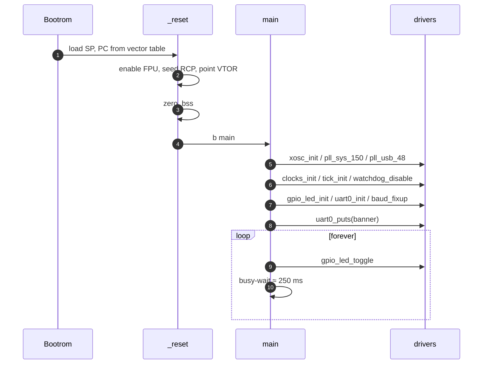
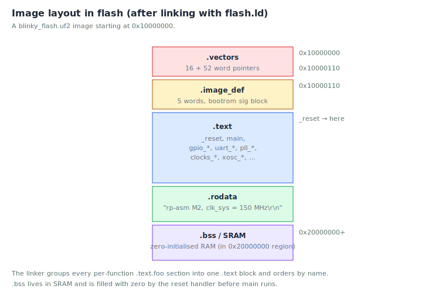

# Chapter 6: Your first program: blinky

Time to read code.

Open `src/main.S` in your editor and we'll go through it line by line.
This is the program you flashed at the end of chapter 5, the one that
boots the RP2350, brings up the clock tree, and starts blinking the
green LED while a banner prints over UART.

## The big picture

Before we read the source, here's the shape of the program in time.
Boot rom hands off, `_reset` runs the M33 prologue, `main` brings up
the chip, then we enter the forever loop.



And here's where the bytes end up in flash:



## The program in full

```asm
    .syntax unified
    .cpu    cortex-m33
    .thumb

    .equ DELAY_COUNT_150MHZ, 12500000

    .section .rodata.banner, "a"
banner:
    .asciz "ticktrace M2 - clk_sys = 150 MHz\r\n"

    .section .text.main, "ax"
    .thumb_func
    .global  main
main:
    @ ---- Clock tree bring-up ---------------------------------------------
    bl      xosc_init                       @ XOSC stable
    bl      pll_sys_150_mhz                 @ pll_sys = 150 MHz
    bl      pll_usb_48_mhz                  @ pll_usb = 48 MHz
    bl      clocks_init                     @ wire muxes
    bl      tick_init                       @ 1 MHz tick to TIMER0/1/WDG
    bl      watchdog_disable                @ explicit safe state

    @ ---- Peripheral init at the new clock rate ---------------------------
    bl      gpio_led_init                   @ LED on GP25
    bl      uart0_init                      @ wrong baud (computed for 12 MHz)
    bl      clocks_post_pll_uart_baud_fixup @ fix to 150 MHz divisors

    ldr     r0, =banner
    bl      uart0_puts

.Lloop:
    bl      gpio_led_toggle

    ldr     r0, =DELAY_COUNT_150MHZ
1:  subs    r0, #1
    bne     1b

    b       .Lloop
```

Thirty-five lines of source, including comments and blank lines. We
will read it five times, once for each conceptual layer.

## Pass 1: the assembler directives

The first three lines have nothing to do with the program. They are
instructions to the **assembler**:

```asm
    .syntax unified
    .cpu    cortex-m33
    .thumb
```

- `.syntax unified`, Use the modern, unified ARM/Thumb syntax (the
  one we've been writing throughout this book). The alternative is the
  pre-2008 "divided" syntax that distinguishes ARM and Thumb mnemonics;
  nobody uses it anymore.
- `.cpu cortex-m33`, Tell the assembler which CPU we're targeting,
  so it knows which instructions are legal.
- `.thumb`, Emit Thumb encodings (which is the only option on M33
  anyway, but explicit is good).

These three lines appear at the top of every `.S` file in ticktrace.

## Pass 2: the constants and data

```asm
    .equ DELAY_COUNT_150MHZ, 12500000
```

`.equ` defines an assemble-time constant. Anywhere in the file we
write `DELAY_COUNT_150MHZ`, the assembler substitutes `12500000`. This
is the C equivalent of `#define`.

Why 12,500,000? It is the number of times the inner busy-loop body
needs to iterate to take about 250 ms at 150 MHz. We'll see why when
we look at the loop itself.

```asm
    .section .rodata.banner, "a"
banner:
    .asciz "ticktrace M2 - clk_sys = 150 MHz\r\n"
```

This puts a string in **read-only data** at a label called `banner`.
Breaking it down:

- `.section .rodata.banner, "a"`, Start a new output section named
  `.rodata.banner`, with the "allocate" attribute (`a`), meaning it
  takes up space in the final image but isn't executable.
- `banner:`, A label. The address of the next byte will be remembered
  under this name.
- `.asciz "ticktrace M2 - clk_sys = 150 MHz\r\n"`, Emit the string,
  followed by a zero byte. (Without the `z`, `.ascii` would omit the
  terminator.) The `\r\n` is the conventional terminal-friendly
  line-ending: carriage return, then newline.

So `banner` is the address of a NUL-terminated string sitting somewhere
in flash. We'll pass its address to `uart0_puts` later.

## Pass 3: defining `main`

```asm
    .section .text.main, "ax"
    .thumb_func
    .global  main
main:
```

- `.section .text.main, "ax"`, A new section, with the "allocate"
  and "executable" attributes. Code goes here.
- `.thumb_func`, The next symbol is a Thumb function. The assembler
  will set bit 0 of its address so that `bx`/`bl` to it works correctly.
- `.global main`, Make the symbol `main` visible to the linker, so
  other files (in our case, `startup.S`) can call it.
- `main:`, The label itself.

The ticktrace reset handler in `src/startup.S` eventually does a
`b main`, which is how this function gets entered.

## Pass 4: the boot sequence

```asm
    bl      xosc_init                       @ XOSC stable
    bl      pll_sys_150_mhz                 @ pll_sys = 150 MHz
    bl      pll_usb_48_mhz                  @ pll_usb = 48 MHz
    bl      clocks_init                     @ wire muxes
    bl      tick_init                       @ 1 MHz tick to TIMER0/1/WDG
    bl      watchdog_disable                @ explicit safe state
```

Six function calls. Each `bl FOO` ("branch and link to FOO") saves the
return address in `lr` and jumps to `FOO`. When `FOO` finishes it
returns to the next instruction here.

What each call does, briefly:

1. **`xosc_init`** turns on the 12 MHz crystal oscillator and waits
   for it to stabilise. The chip can now use the crystal as a clock
   source.

2. **`pll_sys_150_mhz`** programs PLL_SYS, a phase-locked loop, to
   multiply the 12 MHz crystal up to 150 MHz, and waits for lock.

3. **`pll_usb_48_mhz`** does the same for PLL_USB, producing 48 MHz
   (which is what the USB controller and the ADC want).

4. **`clocks_init`** flips the clock muxes so that `clk_sys` and
   `clk_peri` both come from PLL_SYS (150 MHz) and `clk_usb`/`clk_adc`
   come from PLL_USB (48 MHz). Before this point the chip was still
   running at 12 MHz; after this point it's at 150 MHz.

5. **`tick_init`** divides the system clock down to produce a 1 MHz
   tick signal that feeds the TIMER0/1 peripherals and the watchdog
   prescaler. It's a one-time setup.

6. **`watchdog_disable`** ensures the chip's watchdog timer isn't
   armed. If you don't disable it explicitly, certain boot paths can
   leave it enabled and the chip will reset itself a few seconds in.

You don't need to know how these work internally yet. The point of
having them as named functions is that you don't have to. Each one is
documented in `docs/clocks.md` and friends; each one is implemented in
the matching `src/*.S` file; each one has tests in `tests/unicorn/`.
Today you're a user of those functions.

```asm
    bl      gpio_led_init                   @ LED on GP25
    bl      uart0_init                      @ wrong baud (computed for 12 MHz)
    bl      clocks_post_pll_uart_baud_fixup @ fix to 150 MHz divisors
```

Three more:

7. **`gpio_led_init`** configures GP25 as an output pin and drives it
   low to start.

8. **`uart0_init`** brings UART0 out of reset, configures the pads on
   GP0/GP1 for UART function, and sets the baud rate divisors. The
   subtlety: the baud divisors are computed assuming a 12 MHz
   peripheral clock (the rate at v0.1, before we added PLLs).

9. **`clocks_post_pll_uart_baud_fixup`** rewrites those divisors to
   match the actual `clk_peri` rate of 150 MHz, so the UART produces
   real 115200-baud output instead of garbage.

The order matters: you can't fix the baud until the UART has been
initialised, and you can't initialise the UART correctly until you
know the clock is running.

## Pass 5: the message and the loop

```asm
    ldr     r0, =banner
    bl      uart0_puts
```

This is the canonical "call a function with a string argument" idiom.
`ldr r0, =banner` loads the *address* of the `banner` label into `r0`.
Then `bl uart0_puts` calls `uart0_puts`, which by AAPCS convention
expects its first argument in `r0`.

`uart0_puts` walks the bytes at that address, pushing each one into
the UART transmit FIFO, until it hits the NUL terminator. We'll
implement our own version in chapter 10.

```asm
.Lloop:
    bl      gpio_led_toggle

    ldr     r0, =DELAY_COUNT_150MHZ
1:  subs    r0, #1
    bne     1b

    b       .Lloop
```

The forever-loop. Three pieces:

- **`.Lloop:` and `b .Lloop`** form the outer loop. The leading `.L`
  is a GNU convention for *local* labels, symbols that exist only
  within this assembly file, not exposed to the linker. We use it to
  avoid polluting the global namespace.

- **`bl gpio_led_toggle`** flips GP25's state. Internally this is a
  two-cycle store to the `SIO_GPIO_OUT_XOR` atomic-XOR alias we met in
  chapter 4. The LED goes from off to on, or from on to off.

- **The inner delay loop:**

  ```asm
      ldr     r0, =DELAY_COUNT_150MHZ
  1:  subs    r0, #1
      bne     1b
  ```

  `ldr r0, =12500000` puts the iteration count in r0. `1:` is a *local
  numeric label*, these are reusable; you can have many `1:`s in a
  function. `subs r0, #1` decrements r0 and sets the zero flag if the
  result is zero. `bne 1b` means "branch to the nearest label `1`
  **backwards** if not equal (not zero)". So this loops 12,500,000
  times, doing essentially nothing.

  Each iteration is two instructions and takes about 3 cycles on the
  M33. 12,500,000 iterations × 3 cycles ÷ 150,000,000 cycles/second
  ≈ 0.25 seconds. That's the half-period; the full blink is half a
  second; the apparent rate is 2 Hz.

  Yes, busy-looping is a wasteful way to delay. The chip burns 100 mA
  doing nothing. We'll meet better approaches (`wait_for_interrupt`,
  timer-driven scheduling) in chapter 11.

## Where does the program go after `main` returns?

It doesn't return. The unconditional `b .Lloop` at the bottom sends
control back to the top of the loop forever. If you removed it and
let execution "fall through" past the end of `main`, you'd hit
whatever happened to be the next instruction in flash, usually random
data, which the CPU would try to execute and trap on.

A microcontroller's `main` **must** be an infinite loop. There is no
operating system to return to.

## How does `main` get called in the first place?

The reset handler in `src/startup.S` ends with `b main`. The bootrom
loads the vector table from the start of your image, reads word 0 as
the initial stack pointer and word 1 as the initial program counter,
and jumps to that PC. That PC is `_reset`. `_reset` finishes the M33
prologue (enabling the floating-point coprocessor, seeding the random
canary protection, pointing VTOR at the vector table) and then
branches to `main`. Open `src/startup.S` and skim it, you've seen
enough by now that most of it will make sense.

## Building it yourself

If you want to modify and rebuild this exact program:

```console
$ vim src/main.S        # edit
$ make build/blinky_flash.uf2
$ cp build/blinky_flash.uf2 /media/$USER/RPI-RP2/
```

Then watch the LED. Try doubling `DELAY_COUNT_150MHZ`, does it blink
half as fast? (It should.)

## What is in that 1.2 KB?

After your first build the binary is roughly 1,200 bytes. For a
35-line source file that feels large. Here is where each byte goes:

| What | ~Bytes | Notes |
|---|---|---|
| `main()` | 64 | The 35-line source you just read |
| Banner string | 36 | `.asciz "ticktrace M2…\r\n"` + NUL + alignment pad |
| Literal pool | 8 | Constants materialized for `ldr r0, =banner` and `=DELAY_COUNT_150MHZ` |
| Vector table | 64 | Initial SP, `_reset` PC, plus reserved exception-handler slots |
| `_reset` handler | ~100 | FPU enable, RCP seed, VTOR setup, `.bss` zero loop, `b main` |
| Driver library | ~930 | `xosc_init`, 2× PLL, `clocks_init`, `tick_init`, `watchdog_disable`, `gpio_led_init`, `uart0_init`, `baud_fixup`, `gpio_led_toggle`, `uart0_puts` |
| **Total** | **~1,202** | |

The headline: **your logic is 64 bytes**. The other ~1.1 KB is the
minimum infrastructure any bare-metal Cortex-M33 needs before `main`
can run — a vector table, a reset handler that prepares the CPU, and
the clock and peripheral drivers you call. On a chip with no OS,
none of that can be left out.

The cost amortises quickly. A second driver function costs 40–80
bytes; a second *call* to an existing driver in `main` costs four
bytes (one `bl` instruction). By the time you have five peripherals
running, `main` is still tiny and the driver overhead is already paid.

You can inspect the live numbers yourself:

```console
$ arm-none-eabi-size build/blinky_flash.elf
   text    data     bss     dec     hex filename
   1202       0      16    1218     4C2 blinky_flash.elf
$ arm-none-eabi-nm --print-size --size-sort build/blinky_flash.elf
```

`nm --size-sort` lists every symbol in ascending size order. `main`
appears near the top; the larger driver routines sit at the bottom.
Try it: you will see the table above reflected in the output.

## What you now understand

Take a moment to appreciate where you are. You can read every line of
a real piece of firmware. You know what each directive does, what each
function call accomplishes, why the loop is shaped the way it is, and
how the program enters the chip. The ticktrace source tree is no longer
opaque; you can open any `src/*.S` file and the language will mostly
make sense, even if specific peripheral details are still mysterious.

## Exercises

1. **Halve the blink rate.** Edit `DELAY_COUNT_150MHZ` so the LED
   blinks at 1 Hz instead of 2 Hz. Build, flash, observe.

2. **Replace the banner.** Change the `.asciz` string to something
   personal. Rebuild and watch the serial output. *(Note: keep the
   `\r\n` at the end, most terminal programs need both.)*

3. **Count cycles.** The inner busy-loop is `subs r0, #1` / `bne 1b`.
   At 150 MHz, how many *seconds* would `DELAY_COUNT_150MHZ = 1`
   produce? *(About 20 nanoseconds.)*

4. **Why the order?** Why does `clocks_post_pll_uart_baud_fixup` come
   *after* `uart0_init` and not before? *(Because `uart0_init` writes
   IBRD/FBRD assuming 12 MHz; the fixup overrides them. If you reversed
   the order, the fixup would happen first and then immediately get
   overwritten with the wrong values.)*

5. **A faulty change.** Suppose you removed the trailing
   `b .Lloop`. The LED would blink once and then the chip would do
   something unpredictable. Why? *(Execution falls past `main` into
   whatever bytes happen to be next in flash; the CPU tries to execute
   them and will eventually fault.)*

The [next chapter](07-assembler-syntax.md) rounds out the syntax
reference so you can read the *driver* code, not just the user code.

<!-- nav-footer -->

---

[← Chapter 5: Setting up ticktrace](05-setting-up-rp-asm.md) · [Table of contents](README.md) · [Chapter 7: Assembler syntax and instructions →](07-assembler-syntax.md)
