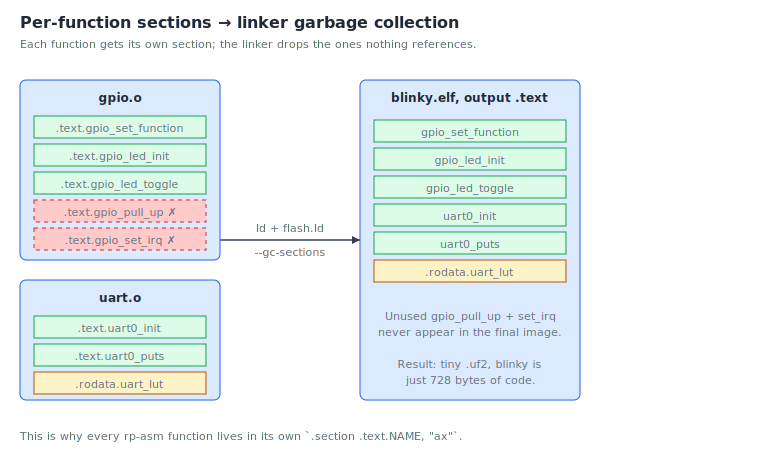

# Chapter 7: Assembler syntax and instructions

You've read one program end-to-end. This chapter zooms in on the
*syntax* of GNU ARM assembly so you can read driver code, not just
user code. Think of it as a reference you'll come back to until the
patterns become instinctive.

## File structure

Every `.S` file in rp-asm has this shape:

```asm
    .include "rp2350.inc"           @ optional: pull in register defs
    .include "gpio.inc"

    .syntax unified                 @ always
    .cpu    cortex-m33              @ always
    .thumb                          @ always

    .equ MY_CONSTANT, 0x42          @ optional

    .section .rodata.things, "a"    @ data section
    .align   2
my_data:
    .word    0x12345678
    .asciz   "a string"

    .section .text.my_func, "ax"    @ code section
    .thumb_func
    .global  my_func
my_func:
    push    {r4, lr}
    @ ... instructions ...
    pop     {r4, pc}
```

The structure is always:

1. **Includes** for shared register/bitfield definitions.
2. **Header directives**: `.syntax unified`, `.cpu cortex-m33`, `.thumb`.
3. **Compile-time constants** with `.equ` if you have any.
4. **Sections**, each containing labels and code/data.

You can have many `.section` directives per file. The linker groups
all sections with the same name (across all files) into one final
output section. We'll see why this granularity matters in the
"sections and the linker" subsection.

## Comments

Three flavours, all interchangeable:

```asm
    movs    r0, #1      @ at-sign starts a comment to end of line
    movs    r0, #1      // C++ style works too
/*  multi-line C-style
    comments also work  */
```

rp-asm prefers `@` for short trailing comments and a banner of
`@ ===...` for section headings.

## Directives: words starting with a dot

A **directive** is an instruction to the assembler, not to the CPU.
They don't produce machine code (well, some do, `.word` produces 4
bytes, but they're not CPU instructions). Here are the ones you'll
meet most:

### Selecting sections

```asm
    .section .text.foo, "ax"        @ executable code
    .section .rodata.bar, "a"       @ read-only data
    .section .bss.baz, "aw", %nobits @ zero-initialised RAM
```

The string `"ax"`/`"a"`/`"aw"` is the section's flags: `a` =
allocatable, `x` = executable, `w` = writable.

### Defining constants

```asm
    .equ FOO, 42                    @ FOO ≡ 42 at assemble time
    .equ BAR, FOO * 2 + 1
```

`.equ` is purely textual substitution at assemble time. Like `#define`
in C.

### Emitting data

```asm
    .byte    0x12                   @ 1 byte
    .hword   0x1234                 @ 2 bytes (halfword)
    .word    0x12345678             @ 4 bytes
    .ascii   "hi"                   @ 2 bytes, no NUL
    .asciz   "hi"                   @ 3 bytes, NUL-terminated
    .space   16                     @ 16 zero bytes
    .align   2                      @ pad until address is multiple of 4
```

### Symbol visibility

```asm
    .global  my_function            @ exported for the linker
    .extern  some_other_function    @ this name lives in another file
    .thumb_func                     @ next symbol is a Thumb function
```

You always pair `.global` with `.thumb_func` for an exported function.

### Including other files

```asm
    .include "rp2350.inc"
```

Direct textual inclusion, like `#include` in C, but without a
preprocessor. The `.inc` files in rp-asm contain only `.equ`
definitions, no code.

## Labels

A **label** is a name for the address of the next byte.

```asm
my_function:                    @ global label
.Llocal:                        @ file-local label
1:                              @ numeric local label
```

Three rules:

1. **Global labels**, anything that doesn't start with `.L` and isn't
   purely numeric. Visible to the linker, can be referenced from other
   files (with `.global` for export).
2. **File-local labels**, start with `.L`. Invisible to the linker;
   you can have `.Lloop` in fifty different files without conflict.
3. **Numeric labels**, just a digit. Reusable. Reference them with a
   direction suffix: `1f` means "the next `1:` forward", `1b` means
   "the previous `1:` backward". Used for tight inline loops where
   inventing a name would be noise.

The blinky inner loop used a numeric label:

```asm
    ldr     r0, =DELAY_COUNT
1:  subs    r0, #1
    bne     1b
```

## Instructions, properly

Now the instruction syntax itself. The general form is:

```
    MNEMONIC{S}{COND}  DEST, SRC1, SRC2{, SHIFT}
```

- **MNEMONIC**, the instruction (e.g. `add`, `mov`, `ldr`).
- **`S` suffix**, update condition flags.
- **`COND` suffix**, conditional execution (e.g. `addeq` = add if
  equal). Used less in Thumb-2 than in classic ARM; we mostly use
  conditional branches instead.
- **DEST, SRC1, SRC2**, registers or immediates.
- **SHIFT**, optional barrel-shift on the second operand.

### Immediates

Constants are prefixed with `#`:

```asm
    movs    r0, #25         @ decimal
    movs    r0, #0x19       @ hex
    movs    r0, #0b11001    @ binary
```

Small immediates fit inline. Big ones need the `ldr Rd, =VALUE`
pseudo-instruction:

```asm
    ldr     r0, =0x40014000     @ assembler picks a load form
    ldr     r1, =my_symbol      @ load an address
```

The assembler tucks the constant into a nearby **literal pool**,
a block of 4-byte values placed at the end of a function, and turns
your instruction into a PC-relative `ldr`. You don't usually have to
think about literal pools, but if you have a very long function and
the pool ends up too far away you'll get a "relocation truncated" error
from the linker. The fix is to insert `.ltorg` at a safe spot to flush
the pool early.

### Shifts and the barrel shifter

Most data-processing instructions accept a shifted register as their
last operand:

```asm
    add     r0, r1, r2, lsl #2  @ r0 = r1 + (r2 << 2)
    orr     r0, r1, r2, lsr #4  @ r0 = r1 | (r2 >> 4)
```

This is occasionally useful in rp-asm, for example when computing
"pin × 8 + offset" to find a per-pin GPIO control register.

### Memory addressing modes

`ldr` and `str` accept several forms:

```asm
    ldr     r0, [r1]            @ r0 = mem[r1]
    ldr     r0, [r1, #4]        @ r0 = mem[r1 + 4]            (offset)
    ldr     r0, [r1, r2]        @ r0 = mem[r1 + r2]           (register)
    ldr     r0, [r1, r2, lsl #2]@ r0 = mem[r1 + (r2 << 2)]    (scaled)
    ldr     r0, [r1, #4]!       @ r1 += 4; r0 = mem[r1]       (pre-index, writeback)
    ldr     r0, [r1], #4        @ r0 = mem[r1]; r1 += 4       (post-index)
```

Most rp-asm driver code uses the offset form, computing the offset
from a peripheral base.

## A walk through real driver code

To make this concrete, let's read a real function from
`src/gpio.S`:

```asm
gpio_set_function:
    lsls    r2, r0, #3                     @ r2 = pin * 8
    adds    r2, #IO_BANK0_GPIO_CTRL_OFFS   @ r2 = 4 + pin*8
    ldr     r3, =IO_BANK0_BASE
    str     r1, [r3, r2]                   @ CTRL = func
    bx      lr
```

Five instructions. Read it:

1. `lsls r2, r0, #3`, Shift `r0` (the pin number) left by 3, putting
   the result in `r2`. Shifting left by 3 is multiplying by 8. The
   GPIO control registers are 8 bytes apart per pin.
2. `adds r2, #IO_BANK0_GPIO_CTRL_OFFS`, Add 4 (the offset of the
   `CTRL` register within each per-pin block) to `r2`. Now `r2` holds
   `4 + pin*8`, the offset of the CTRL register for the requested pin.
3. `ldr r3, =IO_BANK0_BASE`, Load the IO bank's base address into
   `r3`. That's `0x40028000` on the RP2350.
4. `str r1, [r3, r2]`, Store the function code (passed in `r1`) to
   the address `r3 + r2`, i.e. the GPIO CTRL register for that pin.
5. `bx lr`, Return to the caller.

The function takes two arguments, `r0` = pin, `r1` = function code,
following the AAPCS calling convention we'll formalise in chapter 8.
It clobbers `r0`–`r3` (and the assembler is content to do so, because
those are caller-saved). It does not touch `r4`–`r11`, so it does not
need to push anything. It does not call any subroutines, so it does
not need to save `lr`. Eight cycles, total. This is what rp-asm code
looks like all the way down.

## Sections and the linker

Each rp-asm `.S` file puts every function and data blob in its own
named section like `.text.gpio_set_function` or `.rodata.banner`. Why
the granularity?

When you link a project, the linker can drop sections that nothing
references. With one big `.text` section, you'd pay for every function
even if you only use one. With per-function sections, the linker can
**garbage-collect** unused code, keeping your binary tiny.



The linker script in `link/flash.ld` then groups all `.text.*` sections
into one final `.text` output section, all `.rodata.*` into `.rodata`,
and so on. The result is laid out in flash starting at `0x10000000`,
see the image-layout figure in [chapter 6](06-your-first-program.md).

You don't have to write linker scripts to follow this book, `flash.ld`
already exists and the Makefile uses it. But it's good to know the
mechanism is there.

## A miniature cheat sheet

Print this and keep it next to your keyboard:

| Want to… | Instruction |
| --- | --- |
| Set a register to a small constant | `movs r0, #N` |
| Set a register to a 32-bit constant | `ldr r0, =0xFFFFFFFF` |
| Copy a register | `mov r0, r1` |
| Add | `adds r0, r1, r2` |
| Subtract | `subs r0, r1, r2` |
| Bitwise AND / OR / XOR | `ands` / `orrs` / `eors` |
| Shift left / right | `lsls r0, r1, #N` / `lsrs r0, r1, #N` |
| Load 32 bits from memory | `ldr r0, [r1]` |
| Store 32 bits to memory | `str r0, [r1]` |
| Load a byte | `ldrb r0, [r1]` |
| Compare | `cmp r0, r1` |
| Branch if equal/not equal | `beq label` / `bne label` |
| Call a function | `bl func` |
| Return | `bx lr` or `pop {…, pc}` |
| Save registers | `push {r4, r5, lr}` |
| Restore and return | `pop {r4, r5, pc}` |

That's most of everything you'll see. A more complete reference lives
in [appendix B](B-cheat-sheet.md).

## Exercises

1. **Decode a section line.** What do the flag letters in
   `.section .text.foo, "ax"` mean? What about `.section .bss.x, "aw", %nobits`?
   *(a = allocate, x = executable, w = writable, %nobits = the section
   takes no space in the file image; the loader just reserves RAM.)*

2. **Local vs global.** Which of these labels are visible to other
   files? `main:`, `.Lloop:`, `1:`, `gpio_init:`.
   *(`main` and `gpio_init` are global if `.global` was used. `.L…`
   and numeric labels are file-local.)*

3. **Trace an address calc.** Hand-execute
   `lsls r2, r0, #3; adds r2, #4` with `r0 = 7`. What's in `r2`?
   *(7 × 8 = 56, + 4 = 60.)*

4. **Find the literal pool.** Open `build/blinky.elf` with
   `arm-none-eabi-objdump -d` and find a `ldr r0, [pc, #N]` instruction.
   Where in the disassembly is the 4-byte constant it's loading?

5. **Why per-function sections?** Looking at the section-linking
   figure, what would change in the final binary if every function
   in `gpio.S` were in one big `.text.gpio` section?
   *(The linker couldn't drop unused functions individually, the
   whole gpio block would either be included or excluded together,
   blowing up the binary.)*

The [next chapter](08-functions-and-calling-convention.md) explains
the *conventions* around how functions push, pop, and call each other
the rules that make all the rp-asm drivers compose.

<!-- nav-footer -->

---

[← Chapter 6: Your first program](06-your-first-program.md) · [Table of contents](README.md) · [Chapter 8: Functions and the calling convention →](08-functions-and-calling-convention.md)
