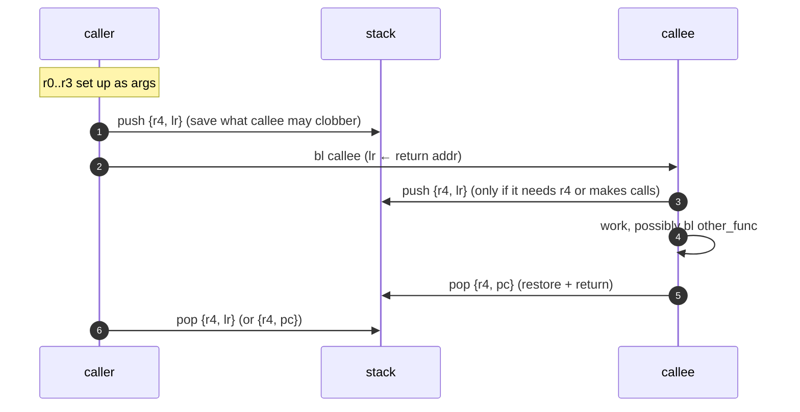
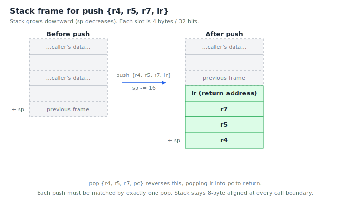

# Chapter 8 — Functions and the calling convention

Up to now we've been calling rp-asm driver functions without thinking
too hard about *how* the calling works. In this chapter we make the
rules explicit, so that you can write your own functions and have
them play nicely with the rest of the SDK.

The set of rules we're about to learn is called **AAPCS** — the ARM
Architecture Procedure Call Standard. Every driver in `src/` obeys
it. Every example in `examples/` obeys it. If your code obeys it too,
your functions can call drivers, drivers can call your functions, and
nothing surprises anyone.

## Why a calling convention exists

When function A calls function B, several questions need answers:

- Where do A's arguments go? In registers? On the stack?
- Where does B put its return value?
- Which registers can B clobber freely, and which must B preserve so
  that A's variables survive the call?
- Where is the return address kept?

Different conventions make different trade-offs. AAPCS is the one ARM
publishes; it's what every ARM C compiler emits and what hand-written
ARM assembly should follow if it wants to interoperate.

## The contract in one table

| Register | Role | Caller responsible | Callee responsible |
| --- | --- | --- | --- |
| `r0` | Argument 1 / return value (low) | Save before call if needed | May freely clobber |
| `r1` | Argument 2 / return value (high) | Save before call if needed | May freely clobber |
| `r2` | Argument 3 | Save before call if needed | May freely clobber |
| `r3` | Argument 4 | Save before call if needed | May freely clobber |
| `r4`–`r11` | General-purpose | Don't need to save | **Must save/restore** if used |
| `r12` (ip) | Scratch | Save before call if needed | May freely clobber |
| `r13` (sp) | Stack pointer | — | Must keep 8-byte aligned at call boundaries |
| `r14` (lr) | Return address | — | Must restore before returning |
| `r15` (pc) | Program counter | — | — |

In one sentence: **r0–r3 and r12 are scratch; r4–r11 must be preserved
across calls.**

## A call, drawn

Here's what happens when one function calls another, in time order:



Two pushes, two pops, paired. Every function the SDK ships obeys this
shape. If you do too, your functions compose with everything else.

## Anatomy of a well-behaved function

The simplest case — a leaf function (one that doesn't call anything
else):

```asm
    .section .text.add_one, "ax"
    .thumb_func
    .global  add_one
add_one:
    adds    r0, #1
    bx      lr
```

No push, no pop. We didn't touch `r4`–`r11`, so nothing to save. We
didn't `bl` anything, so `lr` is still our return address. `bx lr`
returns.

Next case — a function that uses one callee-saved register:

```asm
    .section .text.double_then_inc, "ax"
    .thumb_func
    .global  double_then_inc
double_then_inc:
    push    {r4, lr}
    mov     r4, r0          @ remember the original arg
    bl      add_one         @ r0 = r0 + 1 (clobbers r0..r3)
    adds    r0, r0, r4      @ r0 = (arg + 1) + arg
    pop     {r4, pc}
```

Walking through:

- `push {r4, lr}` — Save `r4` (because we're about to overwrite it)
  and `lr` (because `bl add_one` will overwrite it).
- We stash the input in `r4` because `bl` is going to clobber `r0`.
- After the call, `r0` holds `arg + 1`. We add the saved arg back.
- `pop {r4, pc}` — Restore `r4`, and pop the saved `lr` directly into
  `pc`, which returns. This is the standard return-with-restore idiom.

## Why `pop {…, pc}` works as a return

When you pushed `lr`, you saved the address you want to return to.
When you pop into `pc`, the CPU jumps to that address. The Cortex-M
also inspects bit 0 of the loaded `pc` value to decide Thumb-vs-ARM,
just like `bx`. Since `lr` always has bit 0 set in Thumb code, this
just works.

The alternative is:

```asm
    pop     {r4, lr}
    bx      lr
```

…which is one instruction longer for no benefit. Always use the
`pop {…, pc}` form.

## A picture of the stack

Here's what the stack actually looks like before and after a typical
prologue:



Every push must be matched by exactly one pop, or your stack drifts
and the next return goes somewhere awful.

## Stack alignment

AAPCS requires that `sp` be **8-byte aligned at every call boundary**.
The stack normally grows by 4 bytes per pushed register, so:

- `push {r4, lr}` pushes 8 bytes. Aligned.
- `push {r4, r5, r6, lr}` pushes 16 bytes. Aligned.
- `push {r4, r5, lr}` pushes 12 bytes. **Not aligned.**

If you push an odd number of registers, add a dummy push to keep the
alignment:

```asm
    push    {r4, r5, r6, lr}    @ 16 bytes, aligned
    @ ... work ...
    pop     {r4, r5, r6, pc}
```

…or just pick your pushed register set so the count is even.

## Passing more than 4 arguments

If a function takes more than 4 word-sized arguments, the extras go
**on the stack, right-to-left**, with the same 8-byte alignment rule.

In rp-asm, very few functions take more than 4 arguments, so this
case rarely comes up. When it does (e.g. `multicore_launch_core1`
takes 3 args, so it fits), the convention is the same as in C.

## Return values

- 32 bits or smaller: returned in `r0`.
- 33–64 bits (e.g. a uint64): returned in `r0` (low) and `r1` (high).
- Anything bigger: the caller passes a pointer in `r0` and the callee
  writes through it. (Vanishingly rare in rp-asm.)

## Interrupt handlers are different

There is one important exception: an **interrupt handler** is not
called by code — it's called by the hardware. The CPU itself pushes a
specific set of registers (`r0`–`r3`, `r12`, `lr`, `pc`, and the
PSR) onto the current stack and jumps to your handler.

Because the hardware already saved the caller-saved set, your handler
can clobber `r0`–`r3` freely without saving them. But you still have
to save `r4`–`r11` if you use them. And you return by branching to the
special `lr` value (`EXC_RETURN`) the hardware loaded — usually you
do this implicitly by `bx lr` or, more commonly, by `pop {…, pc}`
just like a regular function.

Chapter 11 has a worked example.

## Worked example: a function that reads a pin

Let's write our own driver function. We want `gpio_read(pin)` — return
1 if the pin reads high, 0 if low.

The hardware register we need is `SIO_GPIO_IN`, at address
`SIO_BASE + 0x04` on the RP2350. It holds the current state of all 32
low-bank GPIO pins, one per bit.

Here it is, AAPCS-compliant:

```asm
    .include "rp2350.inc"

    .syntax unified
    .cpu    cortex-m33
    .thumb

    .section .text.gpio_read, "ax"
    .thumb_func
    .global  gpio_read
gpio_read:
    @ r0 = pin (0..31).  We assume low-bank for simplicity.
    ldr     r1, =SIO_BASE
    ldr     r1, [r1, #SIO_GPIO_IN_OFFS]     @ r1 = all 32 pin inputs
    lsrs    r1, r0                          @ shift our pin into bit 0
    movs    r0, #1
    ands    r0, r1                          @ mask to bit 0
    bx      lr
```

Read it:

- Loads the 32-bit GPIO input snapshot into `r1`.
- Shifts that snapshot right by `pin` positions, putting the bit we
  want into position 0.
- Masks to bit 0 and returns it in `r0`.
- Touches only `r0` and `r1` — both caller-saved — so no push/pop is
  needed and `lr` is untouched.

You'd place this function in a file `mygpio.S`, assemble it alongside
the rest of rp-asm, and call it from your app:

```asm
    movs    r0, #15
    bl      gpio_read
    cbz     r0, .Lpin_low
    @ ... pin was high ...
```

Five instructions, one `bx lr`. That's a complete, AAPCS-compliant
driver function.

## Reading driver source with the convention in mind

Now go open `src/uart.S` or `src/timer.S` and look at any function.
You'll see the same shape repeated:

1. Optional `push {r4..., lr}` if the function uses callee-saved
   registers or calls another function.
2. Argument fetch from `r0`–`r3`.
3. Compute / read / write hardware.
4. Optional `pop {r4..., pc}` (or just `bx lr` for leaf functions).

That's it. There is no other shape. Every function in rp-asm is a
variation on this template.

## Common mistakes

A few patterns that go wrong, with their symptoms:

- **Forgetting to push `lr` before a `bl`.** Your function will
  "return" to whatever was in `lr` on entry — which is the address of
  *its* caller. The bug is silent until you observe weirdness much
  later.
- **Pushing `lr` and then `bx lr` instead of `pop {…, pc}`.** You leak
  stack and `bx lr` jumps to the wrong place. Always pop into `pc`.
- **Clobbering `r4`–`r11` without saving them.** Your caller's local
  variables vanish.
- **Unbalanced push/pop.** Stack pointer drifts. The next `pop` returns
  to garbage.

The compiler catches none of these for you — you're writing assembly
— so develop the habit of reviewing every function's prologue/epilogue
pair as one unit. They should always match.

## Exercises

1. **Push count.** Which of these prologues keep the stack 8-byte
   aligned?
   (a) `push {r4, lr}`
   (b) `push {r4, r5, lr}`
   (c) `push {r4, r5, r6, lr}`
   (d) `push {r4, r5, r6, r7, lr}`
   *(a and c. b pushes 12 bytes; d pushes 20.)*

2. **Add a prologue.** Take the leaf `gpio_read` example. Modify it so
   it calls `gpio_set_function(pin, GPIO_FUNC_SIO)` *first* and then
   reads. Add the necessary push/pop, keeping AAPCS rules.

3. **Spot the bug.** What's wrong with this function?
   ```asm
   bad_func:
       push    {r4, lr}
       mov     r4, r0
       bl      something
       bx      lr
   ```
   *(It leaks the stack: it pushed `r4` and `lr` but doesn't pop them.
   The `bx lr` returns to the address that was in `lr` when `bad_func`
   was entered, *not* to the saved value, because the pushed `lr` is
   still on the stack. Next caller's frame is now misaligned.)*

4. **Why `pop {…, pc}`?** Why is `pop {r4, pc}` strictly better than
   `pop {r4, lr}; bx lr`? *(One fewer instruction, same effect — the
   popped value goes straight into `pc` and the bottom-bit-thumb-marker
   trick still works.)*

5. **ISR rules.** True or false: an ISR can freely clobber `r0`–`r3`
   and `r12` without saving them. *(True — the hardware saved them on
   the way in. But `r4`–`r11` must still be saved if the ISR uses
   them. We meet this again in [chapter 11](11-timers-and-interrupts.md).)*

## What's next

You now know enough to write your own driver functions and call them
from your own apps. The next three chapters apply this to real
peripherals: GPIO in [chapter 9](09-gpio-and-memory-mapped-io.md),
UART in [chapter 10](10-uart.md), and timers with interrupts in
[chapter 11](11-timers-and-interrupts.md).

<!-- nav-footer -->

---

[← Chapter 7 — Assembler syntax and instructions](07-assembler-syntax.md) · [Table of contents](README.md) · [Chapter 9 — GPIO and memory-mapped I/O →](09-gpio-and-memory-mapped-io.md)
