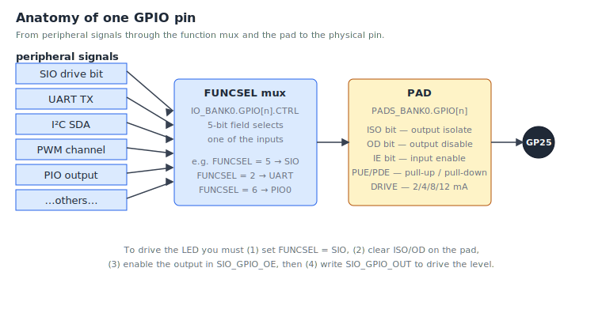

# Chapter 9 — GPIO and memory-mapped I/O

The chip's CPU and its peripherals are separate hardware blocks, but
they share an address space. To talk to a peripheral you just read or
write memory — at certain *special* addresses. This is called
**memory-mapped I/O**, or MMIO, and it is the foundation of every
peripheral driver you'll write.

This chapter walks through GPIO — the simplest peripheral — and shows
the patterns that recur everywhere else.

## What is GPIO?

**GPIO** stands for **general-purpose input/output**. A GPIO pin is a
physical wire that comes out of the package; you can configure it to be
either an input (the chip reads its voltage) or an output (the chip
drives it high or low).

The RP2350 has 48 user GPIOs, numbered GP0 through GP47. On the Pico 2
board, 30 of them are broken out to header pins. GP25 is wired to the
onboard green LED — that's the one we've been blinking.

## Memory-mapped registers

Every peripheral on the RP2350 has a block of **registers** — 32-bit
slots at known memory addresses. Reading and writing those slots is
how you control the peripheral.

For GPIO, the relevant register blocks are:

- **IO_BANK0** at `0x40028000` — per-pin configuration (function select,
  interrupt enables).
- **PADS_BANK0** at `0x40038000` — per-pad electrical settings (drive
  strength, pull-up/down, input/output enable).
- **SIO** at `0xD0000000` — single-cycle I/O. The actual "is this pin
  currently high?" and "drive this pin high/low" registers. SIO is
  attached directly to the CPU bus for speed.



You'll meet all three in this chapter.

## The simplest possible thing

Let's set GP25 high. To do that we need to:

1. Configure GP25 as a software-controlled GPIO (function 5 = SIO).
2. Clear the pad's `ISO`/`OD` reset bits so the pad actually drives.
3. Enable the output direction.
4. Write a 1 to the SIO output bit for pin 25.

Here is the code, the long way:

```asm
    @ 1. FUNCSEL = 5 (SIO) on GP25.
    @    GPIO[n].CTRL = IO_BANK0_BASE + 4 + n*8 = 0x40028000 + 4 + 200 = 0x400280cc
    ldr     r0, =0x400280CC
    movs    r1, #5
    str     r1, [r0]

    @ 2. Clear ISO + OD on PAD 25.
    @    PAD[n] = PADS_BANK0_BASE + 4 + n*4 = 0x40038000 + 4 + 100 = 0x40038068
    @    ISO = bit 8, OD = bit 7  ->  mask = 0x180.  Use the +0x3000 CLR alias.
    ldr     r0, =0x4003B068             @ PADS_BANK0_BASE + 0x3000 + offs
    movs    r1, #0x180
    str     r1, [r0]

    @ 3. SIO_GPIO_OE_SET = SIO_BASE + 0x38.  Set bit 25 = output enable.
    ldr     r0, =0xD0000038
    movs    r1, #1
    lsls    r1, #25
    str     r1, [r0]

    @ 4. SIO_GPIO_OUT_SET = SIO_BASE + 0x28.  Set bit 25 = drive high.
    ldr     r0, =0xD0000028
    movs    r1, #1
    lsls    r1, #25
    str     r1, [r0]
```

Four operations, each a constant load and a store. The LED is now on.

That is the bare metal. Every step is a memory access. There's no
function call, no driver, no abstraction; this is what the silicon
literally does when `gpio_led_init` runs.

## A look at the CTRL register

Step 1 wrote a `5` to the per-pin CTRL register. That register has
several fields packed into 32 bits — we wrote only the bottom 5 bits
(FUNCSEL) and left the others at their reset value of zero.

![GPIO[n].CTRL bit-field layout](figures/gpio-ctrl-register.svg)

For 99% of pin setup you only touch FUNCSEL. The override fields are
there for advanced cases — forcing an output high regardless of what
the peripheral wants, inverting an input, etc.

## The atomic alias trick

Look at step 2 above. It uses the address `0x4003B068`, not
`0x40038068`. The difference is `0x3000`, which is the CLR alias offset.
Storing `0x180` to the CLR alias atomically clears bits 7 and 8 of the
underlying register — no read-modify-write, no race with an interrupt
that might touch another bit of the same register.

We met these in [chapter 4](04-cortex-m33-and-thumb2.md#atomic-register-aliases--the-rp2-trick).
To recap:

| Offset | Effect on the underlying register |
| --- | --- |
| `+0x0000` | Normal read/write |
| `+0x1000` | Atomic XOR — `reg ^= value` for set bits |
| `+0x2000` | Atomic SET — `reg \|= value` for set bits |
| `+0x3000` | Atomic CLR — `reg &= ~value` for set bits |

You will use these constantly. rp-asm's headers define handy symbols
for them: look in `include/rp2350.inc` for `ATOMIC_XOR_OFFS`,
`ATOMIC_SET_OFFS`, `ATOMIC_CLR_OFFS`.

## Using symbolic names

That earlier code with `0x400280CC` is correct but unreadable. Let's
use the symbolic register names from `include/`:

```asm
    .include "rp2350.inc"
    .include "gpio.inc"
    .include "pads.inc"

    @ FUNCSEL = SIO on GP25
    ldr     r0, =IO_BANK0_BASE + 4 + 25 * 8
    movs    r1, #GPIO_FUNC_SIO
    str     r1, [r0]

    @ Clear ISO + OD on PAD 25 via the CLR alias
    ldr     r0, =PADS_BANK0_BASE + ATOMIC_CLR_OFFS + 4 + 25 * 4
    ldr     r1, =(PADS_GPIO_ISO_BITS | PADS_GPIO_OD_BITS)
    str     r1, [r0]

    @ Enable output on GP25 via SIO_GPIO_OE_SET
    ldr     r0, =SIO_BASE + SIO_GPIO_OE_SET_OFFS
    movs    r1, #1
    lsls    r1, #25
    str     r1, [r0]

    @ Drive GP25 high via SIO_GPIO_OUT_SET
    ldr     r0, =SIO_BASE + SIO_GPIO_OUT_SET_OFFS
    movs    r1, #1
    lsls    r1, #25
    str     r1, [r0]
```

Same code, readable. The `.include "gpio.inc"` line pulls in all the
GPIO constant definitions; `pads.inc` does the same for PADS_BANK0;
`rp2350.inc` is the master file with the base addresses.

## The driver version

Now compare with the actual `gpio_led_init` in `src/gpio.S`:

```asm
gpio_led_init:
    @ PAD CLR (ISO | OD)
    ldr     r0, =PADS_BANK0_BASE + 0x3000 + 4 + LED_PIN * 4
    ldr     r1, =PADS_GPIO_ISO_BITS | PADS_GPIO_OD_BITS
    str     r1, [r0]

    @ FUNCSEL = SIO
    ldr     r0, =IO_BANK0_BASE + 4 + LED_PIN * 8
    movs    r1, #GPIO_FUNC_SIO
    str     r1, [r0]

    @ OE SET
    ldr     r0, =SIO_BASE + SIO_GPIO_OE_SET_OFFS
    movs    r1, #1
    lsls    r1, #LED_PIN
    str     r1, [r0]

    @ Start low
    ldr     r0, =SIO_BASE + SIO_GPIO_OUT_CLR_OFFS
    movs    r1, #1
    lsls    r1, #LED_PIN
    str     r1, [r0]

    bx      lr
```

Exactly what we wrote above, plus a final OUT_CLR to put the LED in a
known-off state, plus a `bx lr` to return.

And `gpio_led_toggle` is the single XOR store we keep advertising:

```asm
gpio_led_toggle:
    ldr     r0, =SIO_BASE + SIO_GPIO_OUT_XOR_OFFS
    movs    r1, #1
    lsls    r1, #LED_PIN
    str     r1, [r0]
    bx      lr
```

Three setup instructions and one store. ~6 cycles total. Including
the `bl` to call it, the whole toggle round trip is under ten cycles.
This is what "every cycle matters" means in practice.

## Reading a pin

To check whether a pin is currently high or low, read `SIO_GPIO_IN`:

```asm
    ldr     r0, =SIO_BASE + SIO_GPIO_IN_OFFS
    ldr     r0, [r0]            @ r0 = bitmap of all 32 low-bank pins
    lsrs    r0, #15             @ shift pin 15 into bit 0
    movs    r1, #1
    ands    r0, r1              @ mask everything else
    @ r0 = 0 or 1
```

Same pattern as before: load a base, read/write through it.

## Generalising: any peripheral

GPIO is a special case in one sense (it has the super-fast SIO bank),
but the *pattern* — base address plus register offset plus atomic
alias — is universal on this chip. Here's how the other peripherals
look at the same level of abstraction:

| Peripheral | Base | Pattern |
| --- | --- | --- |
| GPIO config | `IO_BANK0_BASE` | per-pin 8-byte stride |
| PADS | `PADS_BANK0_BASE` | per-pin 4-byte stride |
| GPIO drive | `SIO_BASE` | single bit per pin in a 32-bit word |
| UART | `UART0_BASE` | fixed register offsets |
| I2C | `I2C0_BASE` | fixed register offsets |
| Timer | `TIMER0_BASE` | fixed register offsets |
| DMA | `DMA_BASE` | per-channel 0x40 stride |

Every driver is "compute a register address, store/load a value,
return". That's it. The complexity is in *which* register and *which*
bits — i.e. in the datasheet — not in the CPU instructions.

## A larger exercise

Try this on your hardware:

1. Pick an unused pin (say GP15) and wire an LED to it (with a current-
   limiting resistor of ~330 Ω to GND).
2. Write a function `gpio15_init` modelled on `gpio_led_init` but for
   pin 15.
3. Write `gpio15_set_high` and `gpio15_set_low` using SIO_GPIO_OUT_SET
   and SIO_GPIO_OUT_CLR.
4. In your `main`, call `gpio15_init`, then alternate
   `gpio15_set_high` and `gpio15_set_low` with the existing
   `DELAY_COUNT` busy-loop between them.

If both LEDs blink, you have a working GPIO driver of your own.

## Exercises

1. **Compute an address.** What is the absolute byte address of the
   FUNCSEL field for GP12? *(0x40028000 + 4 + 12 × 8 = 0x40028064.)*

2. **Pick a function.** Looking at the CTRL register figure, you want
   to route GP6 to PWM. Which value goes into FUNCSEL?
   *(4 — `GPIO_FUNC_PWM`, defined in `include/gpio.inc`.)*

3. **Atomic vs not.** Why does `gpio_set_function` use a *non*-atomic
   store (just `str`), while `gpio_led_init` uses the +0x3000 CLR
   alias for the PAD register? *(FUNCSEL is a single 5-bit field that
   needs to be set to one specific value with the rest zero — a plain
   store does it in one cycle. The pad register has multiple
   independent bits set at reset; clearing just two of them without
   touching the others requires the CLR alias.)*

4. **One toggle is two cycles.** Read the `gpio_led_toggle` source.
   Trace each instruction's cost. Why is the entire toggle so cheap?
   *(One LDR address-constant, one MOVS, one LSLS, one STR to the XOR
   alias. The atomic XOR happens in the SIO hardware, not in CPU
   instructions.)*

5. **Build a project.** Wire two LEDs (to GP14 and GP15, each through
   330 Ω). Write a Knight Rider-style scanner that bounces between
   them. Use only the rp-asm GPIO functions plus your own busy-wait.

## What's next

The [next chapter](10-uart.md) looks at the UART driver, which sends
bytes one at a time through a serial port. The pattern is the same —
write to registers — but the registers are richer, and we'll see how
to wait for hardware to be ready.

<!-- nav-footer -->

---

[← Chapter 8 — Functions and the calling convention](08-functions-and-calling-convention.md) · [Table of contents](README.md) · [Chapter 10 — UART →](10-uart.md)
