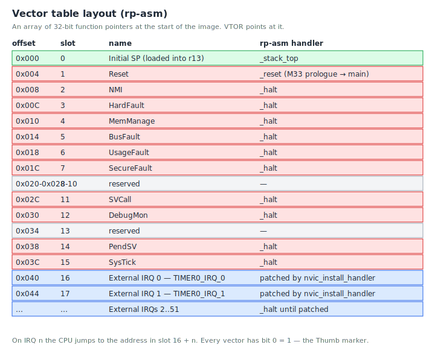
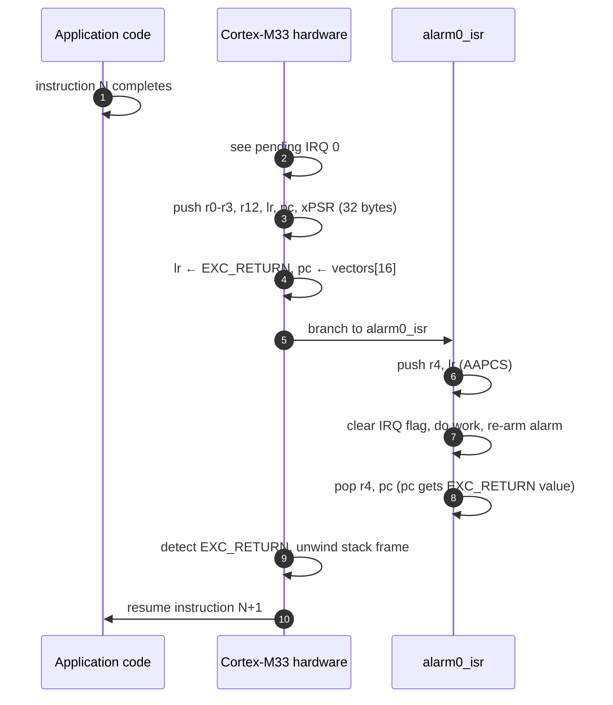
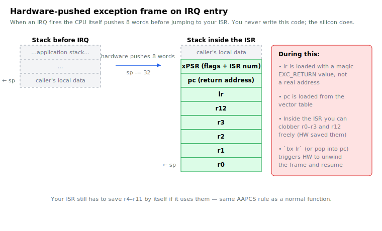

# Chapter 11: Timers and interrupts

Our blinky program loops 12 million times to delay 250 ms. While it
does that, the CPU is fully occupied, 100% busy doing literally
nothing. That's a bad pattern. Microcontrollers should sleep when
there's no work, and wake up only when something happens.

The mechanism for "wake up when something happens" is **interrupts**.
This chapter introduces them through the ticktrace timer driver, and
shows you how to write your own interrupt handler.

## What is an interrupt?

When the CPU is happily executing instructions and a peripheral wants
attention, the peripheral raises a signal. The CPU detects the signal
between instructions, **saves its current state**, and jumps to a
predetermined address called an **interrupt service routine** (ISR) or
**interrupt handler**. When the ISR returns, the CPU restores the
saved state and resumes whatever it was doing, exactly where it left
off, as if nothing had happened.

From the rest of your code's point of view, an interrupt is
*invisible*. It happens between two instructions, the world looks
slightly different on the other side (maybe a counter incremented,
maybe a buffer got a new byte), but no register is wrong, no flag is
wrong, no stack is corrupted.

## The vector table

On the Cortex-M33, each interrupt has a number, and each number maps
to a slot in a table called the **vector table**. The vector table is
just an array of 32-bit function pointers, sitting in memory at a
known address (usually the start of your image, with `VTOR` pointing
at it).



The first 16 slots are for **CPU exceptions** (reset, NMI, hard fault,
SysTick, etc.). The slots after that, up to 480 of them on the M33
are for **external interrupts** from peripherals.

You can see the ticktrace vector table at the top of `src/startup.S`:

```asm
_vectors:
    .word _stack_top            @  0  Initial SP
    .word _reset + 1            @  1  Reset (Thumb bit set)
    .word _halt  + 1            @  2  NMI
    .word _halt  + 1            @  3  HardFault
    ...
    .word _halt  + 1            @ 15  SysTick
    @ External IRQs 0..51 next
    .rept 52
    .word _halt + 1
    .endr
```

Every slot is initialised to `_halt`, a "stop and spin" handler, so
that a stray interrupt doesn't run garbage. Real handlers are patched
in at runtime by `nvic_install_handler`, which writes a function
pointer into the appropriate slot.

The `+ 1` on each word sets bit 0, marking the destination as Thumb
code. The hardware refuses to jump to a vector whose bit 0 is clear.

## The NVIC

The peripheral that decides which interrupts get delivered to the CPU
is the **NVIC**, the Nested Vectored Interrupt Controller. It is
built into the Cortex-M33 itself and lives at the architecturally
fixed address `0xE000E100`.

For each external interrupt line, the NVIC maintains:

- An **enable** bit (must be 1 for the interrupt to fire)
- A **pending** bit (set when the peripheral signals; cleared when the
  ISR starts)
- An **active** bit (set while the ISR is running)
- A **priority** byte (lower number = higher priority)

The ticktrace helpers in `src/nvic.S` give you `nvic_enable`,
`nvic_disable`, `nvic_install_handler`, and `nvic_set_priority`. We
won't go into the bit-level details, read `docs/nvic.md` when you
need them, but they boil down to writing the right bit in the right
NVIC register.

## The TIMER peripheral

The RP2350 has two general-purpose timer blocks, TIMER0 and TIMER1.
Each provides:

- A 64-bit microsecond counter that increments at 1 MHz (after
  `tick_init` runs).
- Four **alarms** that fire an interrupt when the counter reaches a
  programmed value.

To make an alarm fire 500 ms from now:

1. Read the current time (`TIMERAWL`, the low 32 bits of the 64-bit
   microsecond counter).
2. Add 500000.
3. Write the result to `ALARM0`.
4. Enable the alarm.

When the counter reaches that value, ALARM0 fires interrupt IRQ0, and
your ISR runs.

ticktrace wraps this in `alarm_set(idx, abs_time)` and a few helpers.
Read `src/timer.S` if curious.

## A complete interrupt example

We'll port the blinky to use a timer interrupt instead of a busy-loop.
The ISR will toggle the LED; the main loop will just `wfi` (wait for
interrupt), i.e., sleep.

```asm
    .include "rp2350.inc"
    .include "timer.inc"

    .syntax unified
    .cpu    cortex-m33
    .thumb

    .equ ALARM_PERIOD_US, 250000        @ 250 ms

@ -------------------- The ISR --------------------
    .section .text.alarm0_isr, "ax"
    .thumb_func
    .global  alarm0_isr
alarm0_isr:
    push    {r4, lr}

    @ Clear the alarm IRQ flag (W1C in TIMER0_INTR.alarm_0)
    movs    r0, #0              @ timer idx
    movs    r1, #0              @ alarm idx
    bl      alarm_clear_irq

    @ Toggle the LED
    bl      gpio_led_toggle

    @ Re-arm the alarm 250 ms in the future
    bl      time_us_32          @ r0 = TIMERAWL
    ldr     r1, =ALARM_PERIOD_US
    add     r0, r0, r1
    mov     r2, r0
    movs    r0, #0
    movs    r1, #0
    bl      alarm_set

    pop     {r4, pc}

@ -------------------- main --------------------
    .section .text.main, "ax"
    .thumb_func
    .global  main
main:
    bl      xosc_init
    bl      pll_sys_150_mhz
    bl      pll_usb_48_mhz
    bl      clocks_init
    bl      tick_init
    bl      gpio_led_init

    @ Wire alarm0_isr into the vector table for TIMER0_IRQ_0 (line 0)
    movs    r0, #0
    ldr     r1, =alarm0_isr
    bl      nvic_install_handler

    @ Enable IRQ 0 in the NVIC
    movs    r0, #0
    bl      nvic_enable

    @ Enable the alarm-0 interrupt source in TIMER0
    movs    r0, #0              @ timer idx
    movs    r1, #0              @ alarm idx
    bl      alarm_irq_enable

    @ Arm the first alarm
    bl      time_us_32
    ldr     r1, =ALARM_PERIOD_US
    add     r0, r0, r1
    mov     r2, r0
    movs    r0, #0
    movs    r1, #0
    bl      alarm_set

    @ Sleep until interrupts
.Lidle:
    wfi
    b       .Lidle
```

This is `examples/timer_usb_demo.S`, almost verbatim (with the USB
parts removed for clarity). Read it slowly. There are three pieces:

1. **The ISR.** It clears the hardware IRQ flag (otherwise it'd
   re-fire immediately), toggles the LED, and arms the next alarm.
2. **The setup in main.** Install the handler into the vector table,
   enable the IRQ at the NVIC, enable the alarm source at the TIMER,
   arm the first alarm.
3. **The idle loop.** `wfi` is the "wait for interrupt" instruction;
   the CPU halts until any enabled interrupt fires, at which point
   it wakes up, runs the ISR, and returns to the instruction after
   `wfi`. The unconditional `b .Lidle` is just defensive, if the
   `wfi` ever resumes spuriously, we go right back to sleep.

The LED still blinks at 2 Hz. The CPU sleeps 99% of the time. Same
behaviour, dramatically less power, and a foundation you can build on
add a UART RX interrupt, a button interrupt, a USB interrupt.
They all coexist without polling.

## What the hardware actually does on an interrupt

When IRQ 0 fires:



1. The CPU finishes the instruction it was executing.
2. The hardware **pushes a frame** onto the current stack: `r0`–`r3`,
   `r12`, `lr`, `pc`, and the PSR. Eight 32-bit words.
3. `lr` is loaded with a magic value called `EXC_RETURN`, a marker
   the hardware will recognise on the way out.
4. `pc` is loaded with the address in vector slot 16 + IRQ_NUMBER (in
   our case, slot 16 + 0 = `_vectors[16]`).
5. The CPU starts executing the ISR.

Visually, the hardware-pushed frame looks like this:



When the ISR's `pop {…, pc}` happens, the popped value has the
`EXC_RETURN` pattern, and the hardware recognises that. It pops the
frame it pushed, restores all the caller-saved registers, and resumes
the interrupted code.

You don't have to write any of this hardware-level stuff. But knowing
it's happening tells you why `r0`–`r3` are "free" inside an ISR (they
were saved by hardware) and why `lr` has a strange value during one
(it's not a real return address; it's an EXC_RETURN code).

## Things you must do in every ISR

- **Acknowledge / clear** the peripheral's IRQ flag. Otherwise the
  ISR re-fires the instant you return. For the timer, that's
  `alarm_clear_irq`.
- **Save callee-saved registers** if you use any. Same AAPCS rules as
  a regular function.
- **Keep it short.** ISRs preempt everything else; long ISRs starve
  the rest of your program. The rule of thumb is "do the minimum to
  handle the event, set a flag for the main loop to deal with the
  rest".

## Critical sections

If your main code and your ISR share data, say, a counter the ISR
increments and the main loop reads, you need to make sure the ISR
doesn't interrupt a half-finished read/modify/write. The simple tool
is to **disable interrupts** for a short window:

```asm
    cpsid   i               @ disable IRQs
    @ ... do the critical read/modify/write ...
    cpsie   i               @ re-enable IRQs
```

`cpsid` ("change processor state, disable interrupts") sets the
PRIMASK bit and blocks all interrupts. `cpsie` clears it. Use sparingly
while interrupts are disabled, you can't service the timer, the
UART, anything.

A subtler tool is `BASEPRI`, which lets you mask only interrupts
*below* a certain priority. ticktrace's scheduler (`src/sched.S`) uses
this. We don't dig deeper here, but the docs do.

## Exercises

1. **Vector slot math.** UART0's interrupt is RP2350 IRQ line 33.
   What's the byte offset of its slot in the vector table?
   *(16 + 33 = 49 entries, each 4 bytes, so offset = 49 × 4 = 0x0C4.)*

2. **Why bit 0?** Each entry in the vector table has its low bit set
   (e.g. `_reset + 1`). What goes wrong if you forget the `+ 1`?
   *(The CPU treats the loaded `pc` as ARM-mode code and faults
   immediately, there is no ARM mode on Cortex-M.)*

3. **Count cycles.** Look at `alarm0_isr` above. About how many cycles
   does it take? *(Roughly: 2 cycle push, ~10 cycles `alarm_clear_irq`,
   ~6 cycles `gpio_led_toggle`, ~6 cycles `time_us_32`, ~10 cycles for
   the add and `alarm_set` setup, ~10 cycles inside `alarm_set`, 2
   cycles pop. ~50 cycles total, ~330 ns at 150 MHz.)*

4. **Critical section.** Suppose your main loop increments a shared
   counter, and an ISR reads it. Do you need a critical section?
   What if the situations are reversed? *(Reads/writes of a single
   aligned 32-bit value on the M33 are atomic with respect to ISRs
  , they happen in a single cycle. So one-way is safe. A
   read-modify-write needs `cpsid i` / `cpsie i` to be safe either
   direction.)*

5. **Re-fire bug.** Suppose you forget to call `alarm_clear_irq` in
   your ISR. What happens? *(The IRQ stays pending. The moment your
   ISR returns and re-enables interrupts, it re-fires immediately,
   you're stuck in an infinite ISR loop.)*

## What's next

The [next chapter](12-scheduling.md) builds on what you just learned
ISRs as building blocks, into a full scheduler that lets you run
several jobs without a superloop and without an RTOS.

<!-- nav-footer -->

---

[← Chapter 10: UART](10-uart.md) · [Table of contents](README.md) · [Chapter 12: Scheduling →](12-scheduling.md)
