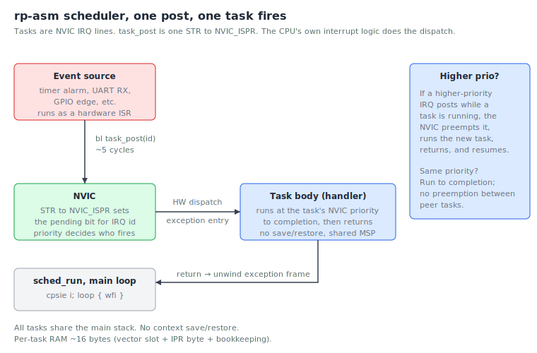

# Chapter 12 — Scheduling

[Chapter 11](11-timers-and-interrupts.md) introduced interrupts as a
way to react to single hardware events. Real firmware usually has more
than one thing to do: read a UART, drive a motor, blink a status LED,
service a button. Once you have more than one job, you need a story
for *which job runs when*. That story is **scheduling**.

This chapter covers the two basic flavours of scheduling, names the
RTOSes you'll meet in the wild, and then explains what rp-asm's
scheduler does — and, just as importantly, what it does not.

## Cooperative scheduling

In a **cooperative** scheduler, each task runs until it voluntarily
yields. The runtime cannot take the CPU back.

The simplest possible cooperative scheduler is the **superloop** —
the pattern you've already used in chapter 6:

```asm
.Lloop:
    bl      do_thing_a
    bl      do_thing_b
    bl      do_thing_c
    b       .Lloop
```

This works fine if every job is short and bounded. It falls apart the
moment one of them takes too long: if `do_thing_b` busy-waits for 50
ms, `do_thing_c` is starved for 50 ms too.

More sophisticated cooperative schedulers add a state machine per
task and explicit yield points. Tasks "suspend" by returning, the
scheduler picks the next one, runs it until *it* returns, and so on.
This is essentially what async/await looks like on a microcontroller.

**Pros:** trivial to reason about — no race conditions inside a task,
no preemption surprises, no per-task stacks needed (one shared stack).
**Cons:** a misbehaving task can hold the CPU forever; latency depends
on the sum of every other task's worst-case runtime.

## Preemptive scheduling

In a **preemptive** scheduler, the runtime can interrupt a running
task at any instruction and switch to a different one. The interrupted
task doesn't know it happened; its registers are saved, the other
task runs, eventually control returns.

Preemption is usually driven by either:

- **A periodic timer interrupt** — the classical "tick-based" RTOS.
  Every N µs the scheduler wakes up and decides who runs next.
- **Event-driven preemption** — an interrupt that triggers a
  *higher-priority* task immediately yanks the CPU away from a
  lower-priority one.

**Pros:** a hung task can be preempted; latency for high-priority
work is bounded; you can compose tasks written by different people
without auditing each other's runtimes.
**Cons:** you need synchronisation primitives (mutexes, semaphores,
queues) because two tasks can interleave at any point; each task
needs its own stack; the runtime is more code and more state.

## RTOSes

A **real-time operating system** (RTOS) is a piece of software that
gives you a fully-featured preemptive (or hybrid) scheduler, plus
synchronisation primitives, timers, message queues, dynamic task
creation, and usually some form of memory protection. The ones you'll
encounter in embedded work:

- **FreeRTOS** — by far the most common. C, BSD-style licence, runs
  on almost every microcontroller. Tick-based preemption, dynamic
  task creation, queues, mutexes, software timers. The pico-sdk ships
  an integration.
- **Zephyr** — newer, Linux Foundation project, much larger in scope
  (device tree, networking, Bluetooth). Used in increasingly serious
  industrial work.
- **ThreadX** — Microsoft (formerly Express Logic). Heavyweight,
  certified for medical/aviation use.
- **embOS, RTX, ChibiOS, NuttX, Mbed OS, …** — there are dozens.
- **QV / QXK** — the "Quantum Leaps" kernels by Miro Samek. QV is a
  *cooperative-within-priority-bands* kernel running on the NVIC.
  rp-asm's scheduler is directly inspired by QV.

An RTOS is the right answer when you need things like "spawn 5 worker
threads at run time," "let this task wait on a mutex for at most 100
ms," or "queue an arbitrary-sized message between producer and
consumer with deep buffering." Once you reach that complexity, build
on an RTOS rather than inventing one.

But — and this is the rp-asm thesis — there is a useful regime
*below* an RTOS where you can get most of the benefits of preemptive
priority scheduling without paying the size, complexity, or
indeterminism of a general kernel.

## rp-asm's scheduler

`src/sched.S` is roughly 200 lines of assembly. It does *not* try to
be FreeRTOS. It implements one specific, very efficient discipline:
**NVIC-priority preemptive scheduling with run-to-completion within
each priority band.** This is the design Miro Samek calls the
"vanilla" kernel, abbreviated **QV**.

The trick is to lean on the hardware the chip already provides. The
Cortex-M33's NVIC is, in effect, a tiny priority-based dispatcher
built into the silicon: it knows how to take the highest-priority
pending IRQ, save registers, branch to a handler, and restore on
return. rp-asm just reuses it.

The mapping:

- A **task** is an NVIC IRQ line. Posting it is one `STR` to
  `NVIC_ISPR` (interrupt set-pending) — about 5 cycles.
- The CPU's exception entry runs the task body at the IRQ's
  priority.
- When the task returns, the exception unwinds and (if there's
  nothing else pending) `wfi` puts the chip back to sleep.
- All tasks share the main stack. There are no per-task stacks to
  size or audit.



### The public API

From `docs/sched.md` and `src/sched.S`:

```
sched_init()                          — set up NVIC pending bits, enable SEVONPEND
task_create(id, fn, prio)             — install fn as the handler for IRQ id at prio
task_post(id)                         — set NVIC_ISPR bit for id (~5 cycles)
task_post_n(mask)                     — post several tasks atomically (~6 cycles)
task_clear(id)                        — cancel a pending post via NVIC_ICPR
sched_run()                           — never returns: cpsie i; loop { wfi }
critical_enter() -> saved_primask     — disable all IRQs, return previous state
critical_exit(saved_primask)          — restore PRIMASK
critical_enter_basepri(prio) -> saved — mask IRQs below prio, allow higher to preempt
critical_exit_basepri(saved)          — restore BASEPRI
```

The discipline that makes this work is that **every task runs to
completion** unless preempted by a strictly higher-priority task.
You never block inside a task. If you want to "sleep 100 ms before
running again," you arm a TIMER alarm whose ISR calls
`task_post(self)` 100 ms later, and return.

### What it costs

- `task_post`: 5 cycles, single STR.
- `task_post` to task entry: 17 cycles (5 + 12 cycle hardware
  exception entry).
- Context switch: **0 cycles** — there is no save/restore, because
  tasks share MSP and the NVIC already does the IRQ frame for you.
- RAM per task: ~16 bytes (a vector slot, a priority byte, some
  bookkeeping). Eight task slots is the default; raise `MAX_TASKS`
  in `sched.inc` if you need more.

For comparison, a FreeRTOS task on the same chip is at minimum a
few hundred bytes of stack plus a TCB. The rp-asm model is two
orders of magnitude lighter, at the cost of giving up some
features.

### Talking between tasks: SPSC byte queues

If a producer (often an ISR) needs to hand bytes to a consumer (a
task), use the lock-free **single-producer, single-consumer** byte
queue in `src/spsc.S`:

```
spsc_byte_push(queue_ptr, byte)       — ~14 cycles
spsc_byte_pop(queue_ptr)  -> r0       — ~10 cycles, -1 if empty
spsc_byte_count(queue_ptr) -> r0      — ~8 cycles
spsc_reset(queue_ptr)
```

Because the queue is single-producer/single-consumer and the
scheduler is run-to-completion, no locks are needed at all — the
hardware ordering guarantees are enough.

A 64-byte queue (declared via the `M_SPSC_BYTE_QUEUE` macro) holds 63
bytes (one slot reserved for the empty/full distinction).

### Optional per-task cycle accounting

`src/sched_stats.S` gives you opt-in DWT-based profiling. Replace
`task_create` with `task_create_traced` and rp-asm wraps your task in
a 25-cycle trampoline that reads the DWT cycle counter before and
after each invocation. Then:

```
task_stats_total(id)        — total cycles consumed
task_stats_invocations(id)  — call count
task_stats_max(id)          — worst-case cycles in a single invocation
task_stats_reset(id)
task_stats_reset_all()
```

This is how you confirm that "task X took less than 2,500 cycles
worst-case" before shipping a control loop.

## What rp-asm's scheduler does NOT do

A direct quote from `docs/sched.md`, edited slightly:

- **No dynamic task creation.** All tasks are declared at startup.
  Eight slots by default. If you need 16, change a constant and
  rebuild.
- **No task deletion** at run time. Tasks live for the life of the
  program.
- **No timers, sleeps, or delays.** Use TIMER0 and the `alarm_*` API
  if you want "fire task X at time T" or "every N µs." The
  scheduler does dispatch; the timer does time.
- **No blocking primitives.** No `sleep_ms`, no mutexes, no condition
  variables. If you need to wait on something, return and let an
  ISR re-post you when the event happens.
- **No priority inversion mitigation.** Run-to-completion plus SPSC
  removes most of the cases where this would matter.
- **No memory protection.** The MPU exists on M33, but rp-asm doesn't
  use it.
- **No watchdog kicking, power management, or partitioning.** These
  are application concerns.

If your problem needs any of those features in a serious way, what
you want is FreeRTOS or Zephyr, not rp-asm. That is a deliberate
trade. rp-asm picks a discipline narrow enough that 200 lines of
asm and a 5-cycle `task_post` cover it.

## When to use it

Reach for `src/sched.S` when:

- You have several independent jobs, each driven by a hardware event
  or a periodic timer.
- The jobs have an obvious priority order (a control loop should
  preempt a USB CDC writer; a UART receive should preempt a status
  LED blink).
- Each job is short and bounded — under a few thousand cycles is
  typical.
- You want hard latency guarantees you can prove with cycle counts.

Stick with the bare superloop from chapter 6 when there's only one
job, or two trivial ones. Reach for an RTOS when you need dynamic
task lifetimes, blocking synchronisation, or features rp-asm
deliberately omits.

## Exercises

1. **Classify these requirements.** For each, say which of (a)
   superloop, (b) rp-asm scheduler, (c) full RTOS is the cheapest
   tool that fits:
   - A 1 Hz LED blink.
   - A motor-control loop at 20 kHz with ≤ 5 µs jitter.
   - A weather station that reads four I²C sensors every minute and
     pushes the readings to a USB host.
   - A WiFi-enabled MQTT bridge that maintains TLS sessions while
     responding to dozens of asynchronous events.

2. **Cycle math.** A periodic task posts itself from a TIMER ISR
   every 1 ms. From the moment the TIMER fires to the moment the
   task body starts executing, how many cycles elapse? *(TIMER ISR
   entry ≈ 12 + ISR body that ends with task_post ≈ 5 + exception
   exit ≈ 5 + new exception entry for the task ≈ 12. Order of 30–40
   cycles, ~250 ns at 150 MHz.)*

3. **Spot the anti-pattern.** What's wrong with this task body?
   ```asm
   my_task:
       push    {lr}
       bl      uart0_puts          @ might spin for several ms
       bl      gpio_led_toggle
       pop     {pc}
   ```
   *(It blocks. `uart0_puts` busy-waits if the FIFO is full, holding
   the priority band for milliseconds. Either kick the bytes through
   a UART TX-empty ISR / SPSC queue, or run this task at a low
   priority and accept the latency.)*

4. **Why 8 task slots?** Why does the scheduler default to 8 and not,
   say, 64? *(Each slot consumes a vector table entry and an NVIC
   priority byte; 8 is a sensible default for small applications.
   Raise `MAX_TASKS` if you need more — the cost is just RAM.)*

5. **Read the source.** Open `src/sched.S` and find `task_post`.
   Confirm it is, in fact, one `STR` plus the AAPCS prologue/epilogue.

## What's next

The [next chapter](13-multicore.md) shows how to bring up the second
CPU core and have both M33s run independent scheduling loops at the
same time.

<!-- nav-footer -->

---

[← Chapter 11 — Timers and interrupts](11-timers-and-interrupts.md) · [Table of contents](README.md) · [Chapter 13 — Multicore →](13-multicore.md)
