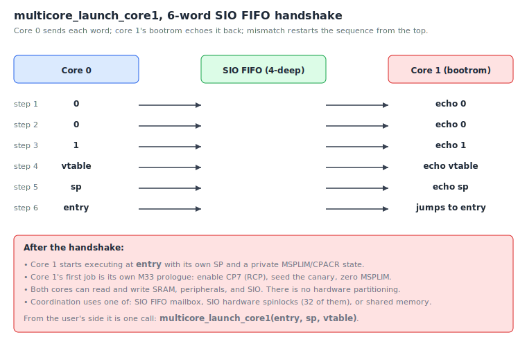

# Chapter 13 — Multicore

The RP2350 has **two** Cortex-M33 cores on the same die. They share
SRAM, peripherals, and the SIO block; each has its own register file,
NVIC, and SysTick. Up to chapter 12 we have used core 0 exclusively
and let core 1 sit in its reset state, idle. This chapter brings the
second core up and uses both.

A second core is not free real estate. It is a real processor that
runs concurrently with the first, and concurrency means
synchronisation. We'll cover the launch handshake, the three primitives
rp-asm gives you for inter-core coordination (FIFO mailbox, hardware
spinlocks, interpolators), the canonical Larson-pattern from the
example tree, and the things rp-asm pointedly does *not* offer.

## What "two cores" buys you

In practice, dual core is useful when you have two workloads with
different latency requirements that don't fight over the same hardware:

- **Hot loop on one core, housekeeping on the other.** Motor-control
  PID on core 0; USB CDC logging on core 1.
- **Real-time on one core, anything-goes on the other.** Time-sensitive
  PWM on core 0; UI / network on core 1.
- **Pipelined data flow.** Core 0 samples ADC + does FIR; core 1
  consumes the filtered stream and ships it over USB.

What it does *not* buy you: a faster single thread, automatic
parallelism of existing single-core code, or transparent load
balancing. There is no kernel, no scheduler across cores. Each core
runs its own `main`, with its own stack, its own vector table, and
its own ideas about what the world looks like.

## Launching core 1

When the chip boots, only core 0 runs your firmware. Core 1 sits in
its bootrom waiting for a wake-up sequence over the **SIO FIFO** —
the inter-core mailbox at `SIO_BASE + 0x050..0x058`.

The wake-up sequence, from `src/multicore.S:12-16`, is six 32-bit
words sent in a strict order, each echoed back by core 1 before the
next is sent:

```
0, 0, 1, vtable, sp, entry
```

If any echo doesn't match, the protocol restarts from the first `0`.
The `vtable` is core 1's vector table base (128-byte aligned), `sp`
is its initial stack pointer, and `entry` is the address core 1
should jump to once the handshake completes. All three are arguments
the user supplies.



You don't write this by hand. rp-asm wraps it as a single call:

```asm
    ldr     r0, =core1_entry        @ where core 1 starts
    ldr     r1, =_core1_stack_top   @ its stack
    ldr     r2, =_ram_vectors       @ its vector table
    bl      multicore_launch_core1  @ returns once core 1 has started
```

`multicore_launch_core1` (`src/multicore.S:131`) builds the command
array on the stack, sends it, and retries on mismatch. When it
returns, core 1 is about to execute the first instruction at `entry`.

### Core 1's prologue

Each M33 core has its own banked **CPACR** (which controls FPU/RCP
access) and **MSPLIM** (stack limit). Core 0's `_reset` in
`src/startup.S` sets these up only for itself. Core 1's `entry`
function therefore has to repeat the prologue for its own copy:

```asm
core1_entry:
    @ Enable CP7 (RCP) on core 1's CPACR
    ldr     r0, =0xE000ED88
    movs    r1, #0xC0
    lsls    r1, r1, #8
    str     r1, [r0]

    @ Seed RCP canary (idempotent — guarded against double init)
    @ ... see examples/multicore_usb_demo.S:90-105 ...

    @ Zero MSPLIM so pushes don't fault
    movs    r0, #0
    msr     msplim, r0

    @ Now we are a real M33 core. Do whatever we are here for.
    bl      do_core1_work
```

`examples/multicore_usb_demo.S:90-105` has the canonical prologue;
copy it into your own `core1_entry`. After it, core 1 can use the
FPU, push to its own stack, and call any rp-asm driver.

## Coordinating: the three primitives

Once both cores are running, they share SRAM and every peripheral
register. They do **not** share registers, stacks, or vector tables.
rp-asm gives you three primitives for getting them to cooperate.

### SIO FIFO mailbox

The same FIFO used for launch is also a general-purpose 4-deep word
mailbox in each direction. Each core can push a 32-bit word and the
other can pop it.

```asm
multicore_fifo_drain()                — empty the inbound FIFO
multicore_fifo_push_blocking(word)    — spin on RDY, write, SEV
multicore_fifo_pop_blocking() -> r0   — spin on VLD (with wfe), read
```

Use it when one core wants to hand the other a small piece of news:
a counter snapshot, a "go" signal, a single sample. It's too shallow
to be a real queue — for bulk data, put a ring buffer in SRAM and
use the FIFO just for the "wake up, there is something for you"
notification.

### Hardware spinlocks

The RP2350 has **32 hardware spinlocks** at `SIO_BASE + 0x100 + n*4`.
The protocol is the simplest possible: reading the address returns
non-zero if you got the lock and 0 if someone else has it; any write
releases it.

```asm
spin_try_lock(idx)      -> r0   — 0 = busy, non-zero = acquired
spin_lock_blocking(idx)         — busy-wait until acquired
spin_unlock(idx)                — release
```

Use a spinlock when both cores will mutate the same data structure.
Hold it for as few cycles as possible — these are *busy-wait* locks,
not blocking ones; while one core holds the lock, the other burns
power spinning.

Convention: pick a spinlock number for each shared resource and use
it consistently. `examples/multicore_full_usb_demo.S` uses spinlock 0
for a shared counter that both cores touch.

### Interpolator units

Each core has two **interpolators** (INTERP0 at `SIO + 0x80`,
INTERP1 at `SIO + 0xC0`). They are tiny per-core hardware blocks that
do shift-mask-add in a single cycle:

```
result = ((ACCUMx >> SHIFT) & mask) + BASEy
```

They aren't really a multicore primitive — they're per-core hardware
— but they show up in multicore examples because each core has its
own pair and they're useful for the kind of tight fixed-point work
people do *inside* a core 1 hot loop.

```asm
interp_set_accum(idx, lane, value)
interp_set_base (idx, lane, value)
interp_set_ctrl (idx, lane, ctrl_word)
interp_peek (idx, which) -> result   — read without advancing
interp_pop  (idx, which) -> result   — read and advance accumulators
```

The classical use case is texture mapping, table lookup with
interpolation, or fast index generation in a DSP loop. See
`docs/sched.md` references and the second multicore example for a
worked use.

## The canonical pattern

Read `examples/multicore_usb_demo.S` and
`examples/multicore_full_usb_demo.S` — they're the templates.

A simplified shape:

```asm
    @ ============================================================
    @ Core 0 — owns USB, prints heartbeat
    @ ============================================================
main:
    bl      xosc_init
    bl      pll_sys_150_mhz
    bl      pll_usb_48_mhz
    bl      clocks_init
    bl      tick_init
    bl      usb_cdc_init

    ldr     r0, =core1_entry
    ldr     r1, =_core1_stack_top
    ldr     r2, =_ram_vectors
    bl      multicore_launch_core1

.Lloop_c0:
    ldr     r0, =msg
    bl      cdc_puts
    bl      delay_1s
    b       .Lloop_c0

    @ ============================================================
    @ Core 1 — owns the LED
    @ ============================================================
core1_entry:
    @ ... CPACR + RCP + MSPLIM prologue ...
    bl      gpio_led_init
.Lloop_c1:
    bl      gpio_led_toggle
    bl      delay_500ms
    b       .Lloop_c1
```

Two independent main loops, sharing only the GPIO/SIO hardware. No
locks needed — they touch disjoint pins. The pattern scales: if both
cores want to read or write the same shared variable, wrap the
access in a spinlock; if one core wants to notify the other, send
through the FIFO.

## What multicore in rp-asm does NOT do

A short, honest list:

- **No inter-core scheduling.** Each core runs its own scheduler (or
  superloop). There is no task migration. A task posted on core 0's
  NVIC fires on core 0 only.
- **No transparent shared data structures.** No "lock-free queue
  spanning cores" library. Build what you need from SRAM, spinlocks,
  and the FIFO.
- **No blocking inter-core wait.** `spin_lock_blocking` busy-waits;
  it does not put the core to sleep. If you want a sleep-and-wake
  pattern, the inbound FIFO already supports it (the popper sits in
  `wfe`).
- **No core teardown.** Once core 1 is launched, you can't kill it
  cleanly from core 0. You can spin it on a flag if you want it
  idle.
- **No NUMA tricks.** SRAM is uniform-access from both cores. There
  is no per-core fast SRAM region exposed in rp-asm beyond what the
  bootrom defines.

If you need an SMP-style scheduler with task migration, look at
FreeRTOS SMP or Zephyr's SMP build. rp-asm stops where the hardware
stops being simple.

## Exercises

1. **Whose job?** For each task below, decide whether to run it on
   core 0, core 1, or doesn't matter:
   - A 20 kHz PID loop driving a brushed motor.
   - A USB CDC log writer that prints debug strings.
   - A SysTick-driven status LED.
   - Reading an SD card over SPI to load a config file at startup.

2. **Lock or no lock?** Two cores both increment a shared `uint32_t`
   counter. Does this need a spinlock on the RP2350? *(Yes — the
   read-modify-write is not atomic across cores even though a single
   STR is. Wrap the increment in `spin_lock_blocking(0)` /
   `spin_unlock(0)`.)*

3. **FIFO depth.** The SIO FIFO holds 4 words. If core 0 pushes 5
   words back-to-back and core 1 isn't reading, what happens to the
   5th push? *(It blocks — `multicore_fifo_push_blocking` spins on
   the RDY flag until there's room.)*

4. **Why does core 1 need its own prologue?** Why doesn't core 0's
   `_reset` cover core 1 as well? *(CPACR and MSPLIM are banked
   per-core. Whatever core 0 writes to them affects core 0 only.
   Core 1 starts in its reset state for those registers, so its
   entry function must repeat the prologue.)*

5. **Read the example.** Open `examples/multicore_full_usb_demo.S`.
   Identify (a) where core 1 is launched, (b) what spinlock number
   protects the shared counter, (c) what core 0 reads from the FIFO,
   and (d) how the interpolator on each core is used.

## What's next

The [final chapter](14-where-to-go-next.md) maps the remaining
peripherals in `src/` — DMA, PIO, the C and Rust bridges — and gives
you project ideas to build on top of everything we've covered.

<!-- nav-footer -->

---

[← Chapter 12 — Scheduling](12-scheduling.md) · [Table of contents](README.md) · [Chapter 14 — Where to go next →](14-where-to-go-next.md)
