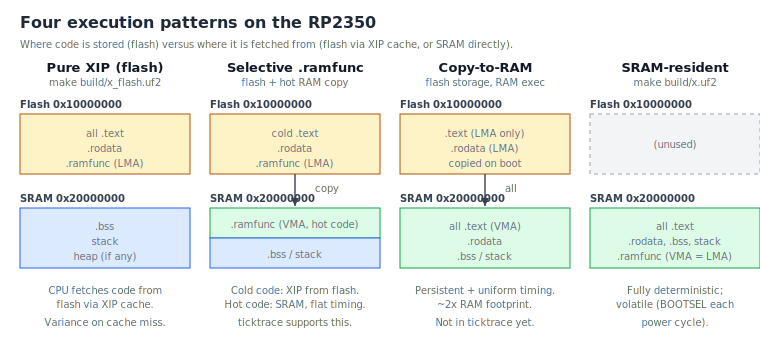

# Appendix D: Memory layouts and execution patterns

Up to chapter 14 this book has treated flash-vs-SRAM as a binary
choice: build the flash variant for production, the SRAM variant for
emulation tests. The RP2350 hardware supports more than two patterns,
and the right choice for hard-real-time code (motor control,
audio DSP, anything with a strict cycle budget) is usually neither
of the two defaults.

This appendix lays out the four patterns the chip can run, which ones
rp-asm currently supports, and shows how to put a hot function into
SRAM while leaving the rest of the program in flash.

## The four patterns



| Pattern | Code lives in | Code runs from | rp-asm support |
| --- | --- | --- | --- |
| **Pure XIP (flash)** | QSPI flash at `0x10000000` | Flash, via the 16 KB XIP cache | Yes: `make build/<name>_flash.uf2` |
| **SRAM-resident** | SRAM at `0x20000000` | SRAM, ~1 cycle/fetch | Yes: `make build/<name>.uf2` |
| **Selective `.ramfunc`** | Flash + a `.ramfunc` section that the startup copies to SRAM | Cold code from flash, hot code from SRAM | Yes (used by `qmi_set_clkdiv` today) |
| **Copy-to-RAM** | Flash only | SRAM after the startup copies everything | Not yet — would need a third linker script |

The two "all-flash" and "all-SRAM" extremes are the ones we've been
using. The middle two are about putting cycle-critical code in SRAM
without giving up persistent flash storage.

## Pattern 1: pure XIP from flash

This is what `*_flash.uf2` does today. The bootrom validates the
IMAGE_DEF block at the start of flash, hands off to `_reset` at
`0x10000000 + offset`, and the CPU fetches every instruction from
QSPI flash through the on-chip XIP cache.

The XIP cache is 16 KB. On a cache hit, fetches are essentially
free. On a cache miss the CPU stalls while the cache controller
issues a QSPI read — tens of cycles, depending on the QSPI clock
divider you configured. For most code, the cache absorbs the
penalty: hot loops live in cache and run at SRAM-like speeds.

When it fails:
- The first call to a function is a cold miss.
- Working sets larger than 16 KB thrash the cache.
- ISRs that haven't run recently pay the miss cost on entry.
- Code that interleaves with other code paths in unpredictable
  patterns can thrash the cache.

For most application code this doesn't matter. For a 20 kHz motor
control ISR it does.

## Pattern 2: SRAM-resident

This is what `<name>.uf2` does today. The bootrom loads the image
straight into SRAM at `0x20000000` and jumps there. Every fetch is
from SRAM, so there is no XIP variance.

Cost: the program is volatile. Lose power, lose the program. You
re-flash through BOOTSEL on every power-up. For a controller you're
shipping that's unacceptable; for development and benchtop work
it's fine.

This is the simplest path to **fully deterministic timing**: nothing
in your binary ever fetches from QSPI during normal operation.

## Pattern 3: selective `.ramfunc`

This is the middle path: store the program in flash, but mark
specific functions as belonging to a `.ramfunc` section. At
startup, the reset handler copies those functions from flash (LMA)
to SRAM (VMA), and afterwards calls into them go to SRAM addresses.
Everything else stays in flash and runs XIP.

rp-asm already supports this. The wiring is:

- `link/flash.ld:45` defines a `.ramfunc` output section whose load
  address is in flash but whose virtual address is in SRAM, plus
  three linker symbols: `__ramfunc_load__`, `__ramfunc_start__`,
  `__ramfunc_end__`.
- `src/startup.S:150–160` copies from the load address to the
  virtual address in `_reset`. If `.ramfunc` is empty the loop runs
  zero iterations.
- `link/sram.ld:48–58` defines the same section but with VMA == LMA
  (since the whole image already lives in SRAM, no copy is needed).

To put a function in SRAM on a flash build, give it its own
`.ramfunc.*` section:

```asm
    .section .ramfunc.my_isr, "ax"
    .thumb_func
    .global  my_isr
my_isr:
    push    {r4, lr}
    @ ...isr body, runs from SRAM, no XIP variance...
    pop     {r4, pc}
```

The naming convention is `.ramfunc.NAME`, mirroring the per-function
`.text.NAME` pattern (chapter 7). The linker collects all
`.ramfunc.*` into one block.

`src/qmi.S` has a real example: `qmi_set_clkdiv` must run from SRAM
because it reprograms the QSPI clock divider that the CPU's
instruction fetch is currently using. If it ran XIP, the CPU would
mid-flight try to fetch the next instruction with the wrong clock
config and lock up.

For motor control, the recipe is:

1. Identify the cycle-critical paths: the PID ISR, the encoder
   read, any function on the hot loop.
2. Move them to `.ramfunc` sections.
3. Measure with DWT (Appendix C) to confirm the cycle-count
   variance dropped.

## Pattern 4: copy-to-RAM (not yet in rp-asm)

The pico-sdk supports a `PICO_COPY_TO_RAM` build type that puts the
entire `.text` and `.rodata` in flash (LMA), but with VMA in SRAM
and a wholesale copy at startup. Result: persistent storage in
flash, deterministic execution in SRAM, at the cost of roughly 2×
RAM footprint (the whole program now lives in both places, though
the flash copy is read-only after boot).

rp-asm doesn't currently have this. Adding it would mean:

- A third linker script (`link/flash_copy_to_ram.ld`) that places
  `.text*` and `.rodata*` with LMA in flash, VMA in SRAM.
- A small extension to `_reset` to copy the whole `.text`/`.rodata`
  block before calling `main`.
- A new Makefile target (`*_flash_to_ram.uf2`).

If you find yourself wanting this, the pico-sdk's
`src/rp2_common/pico_crt0/rp2350/memmap_copy_to_ram.ld` is the
canonical reference.

## A worked example: cycle variance with and without `.ramfunc`

`examples/ramfunc_demo.S` defines the same busy-loop function twice:
once in default `.text` (lives in flash on the flash build), once in
`.ramfunc.busy_ram` (always lives in SRAM after startup copies it).
At runtime it calls each one many times, captures DWT cycle counts,
and prints min/max/mean over UART0:

```
xip   busy: min=  1004 max=  1042 mean=  1006.4
ram   busy: min=  1003 max=  1003 mean=  1003.0
```

(Real numbers vary by silicon, QSPI clock divider, and whether the
inner loop fits in the XIP cache. The point is the variance, not
the absolute count.)

On the flash variant on real hardware, you'll see the XIP path's
`max` exceed its `min` because of occasional cache misses — the
distribution has a tail. The `.ramfunc` path is dead-flat because
every iteration runs from SRAM. On the SRAM variant both paths are
flat (the whole image lives in SRAM).

Build and run:

```console
$ make build/ramfunc_demo_flash.uf2
$ cp build/ramfunc_demo_flash.uf2 /media/$USER/RPI-RP2/
$ minicom -D /dev/ttyUSB0 -b 115200
```

The demo prints once per second after each measurement burst.

## Choosing the right pattern for your workload

Use this decision tree:

```
Do you need persistent firmware (survives power cycle)?
├─ No   →  SRAM-resident  (make build/x.uf2)  ← simplest, fully deterministic
└─ Yes
    │
    Does anything in your code have a strict cycle budget
    (ISR latency, control-loop jitter, audio sample rate)?
    │
    ├─ No   →  Pure XIP from flash  (make build/x_flash.uf2)
    │
    └─ Yes
         │
         Is the cycle-critical code <2 KB total?
         ├─ Yes  →  .ramfunc the critical paths; rest of program in flash
         └─ No   →  consider copy-to-RAM (would need to add support
                    to rp-asm; see Pattern 4 above)
```

For most rp-asm users the answer is one of the first two. Motor
control, audio, software-emulated PIO state machines — those are
the cases where `.ramfunc` earns its keep.

## What to read next

- `src/qmi.S` and `link/flash.ld:45` — the one real `.ramfunc`
  user in the codebase today.
- `src/startup.S:150–160` — the actual copy loop.
- `examples/ramfunc_demo.S` — the cycle-variance demo described
  above.
- pico-sdk's `src/rp2_common/pico_crt0/rp2350/memmap_copy_to_ram.ld`
  — the canonical reference for the full copy-to-RAM pattern, if
  you decide to add it to rp-asm.
- Appendix C (Debugging) — for the DWT mechanics used in the demo.

<!-- nav-footer -->

---

[← Appendix C: Debugging](C-debugging.md) · [Table of contents](README.md)
